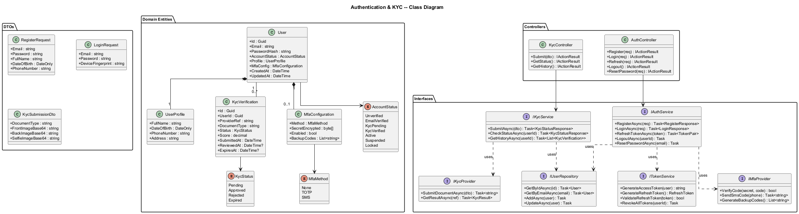
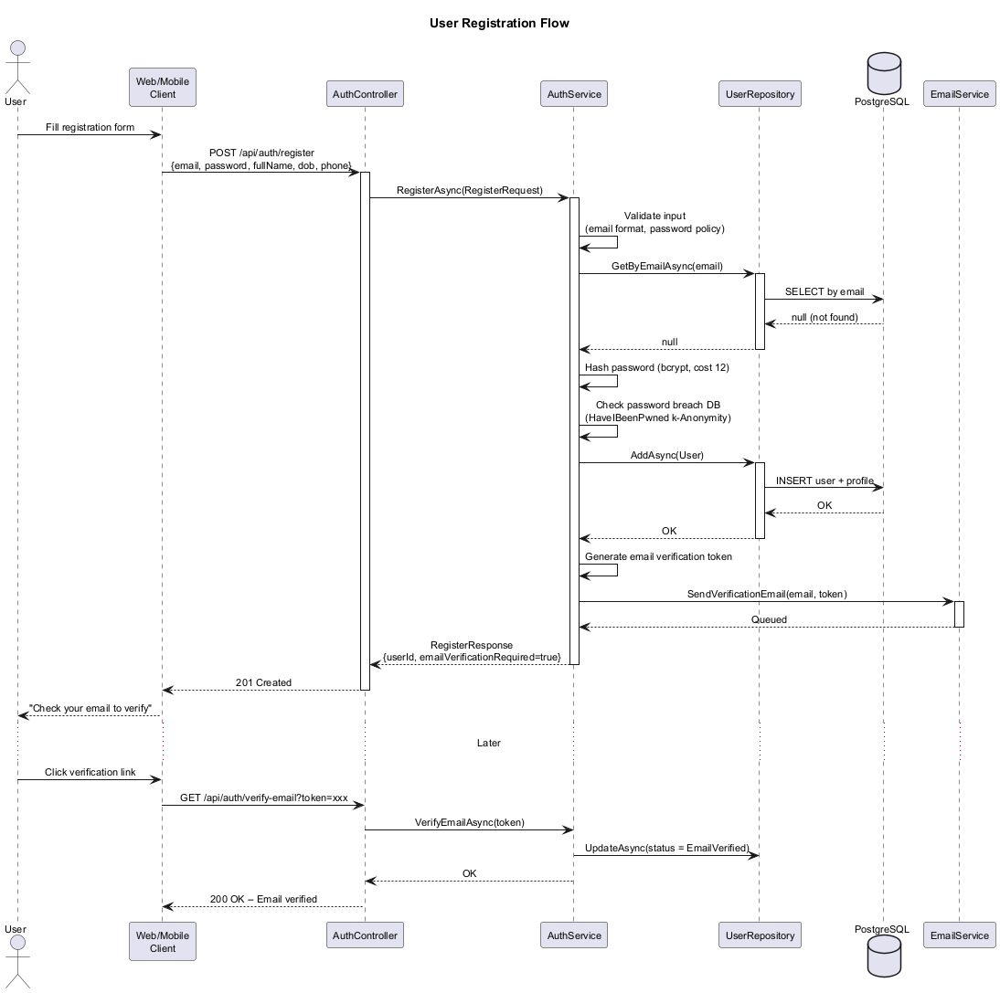
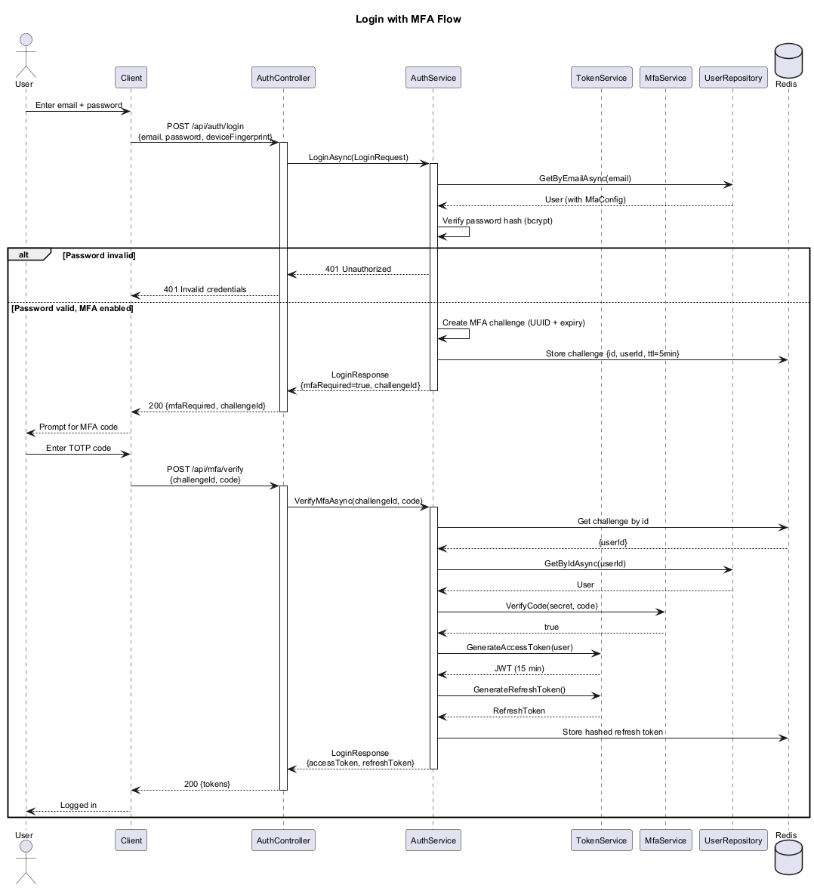
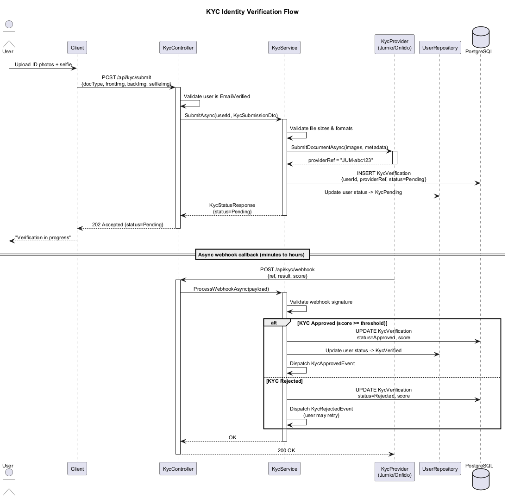
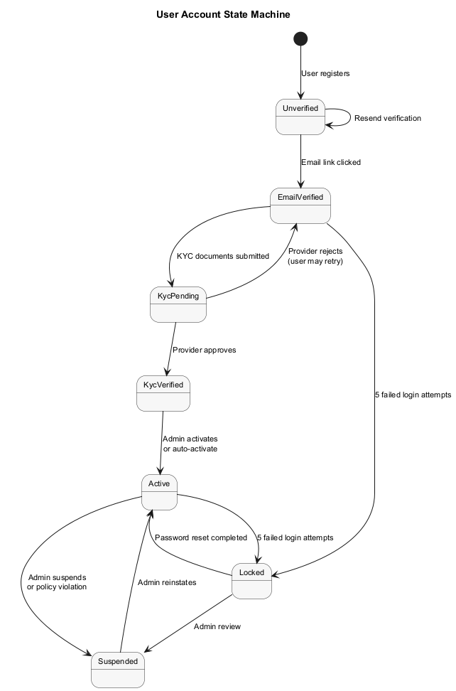
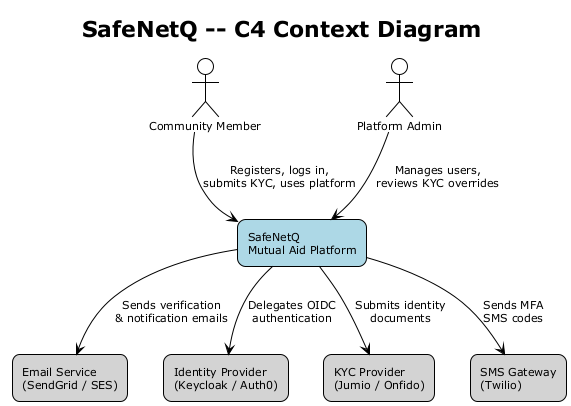
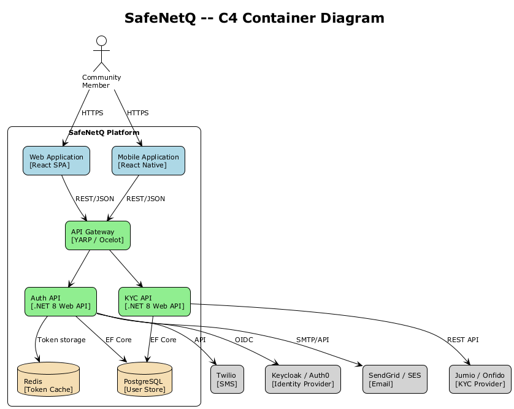
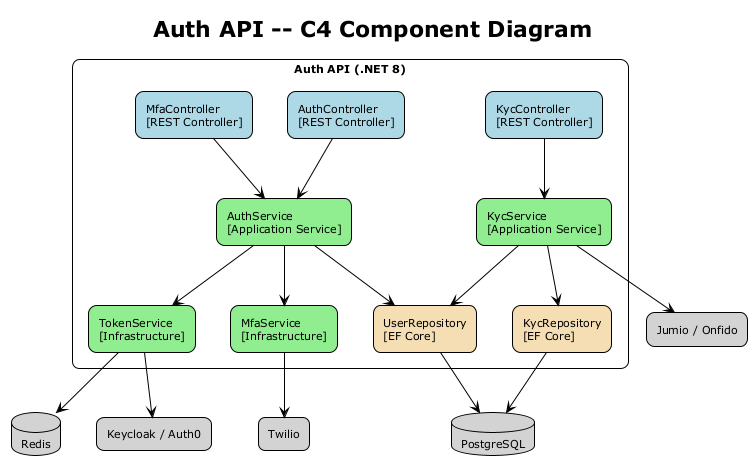

# Authentication & KYC -- Detailed Design

## 1. Feature Purpose and Scope

The Authentication & KYC feature provides the identity foundation for the SafeNetQ Community Emergency Mutual Aid Platform. It governs how users register, prove their identity, authenticate on each visit, and maintain secure sessions. Because SafeNetQ facilitates financial mutual-aid transactions, every participating member must pass Know-Your-Customer (KYC) verification that satisfies **FINTRAC** requirements and respects **PIPEDA** privacy obligations.

### In Scope

| Capability | Description |
|---|---|
| **User Registration** | Email/password sign-up with email verification. |
| **Authentication** | JWT-based stateless auth with short-lived access tokens and rotating refresh tokens. |
| **Multi-Factor Authentication (MFA)** | TOTP (authenticator app) and SMS one-time-code as second factors. |
| **KYC Identity Verification** | Document upload, liveness check, and third-party identity scoring via Jumio or Onfido. |
| **Password Reset** | Secure, time-limited password-reset flow with email link. |
| **Session Management** | Token lifecycle, device tracking, forced logout, and concurrent-session limits. |

### Out of Scope

- OAuth2 social login (future phase).
- Biometric device-local authentication (future phase).
- Transaction-level authorization rules (covered by the Authorization & Roles feature).

---

## 2. Technology Choices

| Layer | Technology | Rationale |
|---|---|---|
| Runtime | **.NET 8+** | LTS, high performance, native AOT option. |
| Architecture | **Clean Architecture** | Enforces dependency inversion; domain is framework-agnostic. |
| Identity Provider | **Keycloak** (self-hosted) or **Auth0** (SaaS) | Standards-based OIDC/OAuth2, MFA, user federation. |
| KYC Provider | **Jumio** or **Onfido** | Document AI, liveness detection, global coverage. |
| Database | **PostgreSQL 16** | JSONB for flexible profile data, row-level security. |
| Encryption | **AES-256-GCM** at rest; **TLS 1.3** in transit | FINTRAC & PIPEDA compliance. |
| Caching | **Redis 7** | Refresh-token allow-lists, rate-limit counters. |

---

## 3. Security Considerations

1. **FINTRAC KYC Compliance** -- Collect and verify government-issued photo ID, full legal name, date of birth, and current address before enabling financial features.
2. **PIPEDA Privacy** -- Minimize data collection; encrypt PII at rest with AES-256-GCM; retain KYC artefacts only as long as legally required; provide data-export and deletion endpoints.
3. **Password Policy** -- Minimum 12 characters, bcrypt cost factor 12, breach-database check via k-Anonymity (HaveIBeenPwned API).
4. **Token Security** -- Access tokens: 15-minute expiry, RS256 signed. Refresh tokens: 7-day sliding window, one-time use, stored hashed in Redis.
5. **Rate Limiting** -- Login: 5 attempts per 15 minutes per IP; Registration: 3 per hour per IP; KYC submission: 3 per day per user.
6. **Audit Logging** -- Every authentication and KYC event is written to an append-only audit log with actor, action, timestamp, IP, and device fingerprint.

---

## 4. Key Components

### 4.1 Domain Entities

| Entity | Purpose |
|---|---|
| `User` | Root aggregate -- id, email, password hash, account status, timestamps. |
| `UserProfile` | Value object owned by User -- legal name, date of birth, address, phone. |
| `KycVerification` | Tracks each KYC attempt -- provider reference, document type, status, score, expiry. |
| `MfaConfiguration` | Stores MFA method (TOTP / SMS), secret (encrypted), enabled flag, backup codes. |
| `RefreshToken` | Hashed token value, device info, expiry, revocation flag. |

### 4.2 Interfaces (Ports)

| Interface | Responsibility |
|---|---|
| `IAuthService` | Register, Login, RefreshToken, Logout, ResetPassword. |
| `IKycService` | SubmitVerification, CheckStatus, GetVerificationHistory. |
| `IUserRepository` | CRUD for User aggregate (includes profile, MFA config). |
| `IKycRepository` | Persistence for KycVerification records. |
| `ITokenService` | Generate, validate, and revoke JWT access & refresh tokens. |
| `IMfaProvider` | Verify TOTP code, send SMS code, generate backup codes. |
| `IKycProvider` | Adapter interface for Jumio/Onfido SDK calls. |

### 4.3 Application Services

| Service | Notes |
|---|---|
| `AuthService : IAuthService` | Orchestrates registration, credential validation, token issuance, MFA challenge. |
| `KycService : IKycService` | Orchestrates document submission to external provider, polls/receives webhook results, updates account state. |
| `TokenService : ITokenService` | Wraps `System.IdentityModel.Tokens.Jwt`; manages RS256 key rotation. |
| `MfaService : IMfaProvider` | TOTP via `OtpNet`; SMS via Twilio adapter. |

### 4.4 Controllers (API Layer)

| Controller | Key Endpoints |
|---|---|
| `AuthController` | `POST /api/auth/register`, `POST /api/auth/login`, `POST /api/auth/refresh`, `POST /api/auth/logout`, `POST /api/auth/password-reset` |
| `KycController` | `POST /api/kyc/submit`, `GET /api/kyc/status`, `GET /api/kyc/history` |
| `MfaController` | `POST /api/mfa/enable`, `POST /api/mfa/verify`, `POST /api/mfa/disable` |

### 4.5 DTOs

| DTO | Direction | Fields (summary) |
|---|---|---|
| `RegisterRequest` | In | Email, Password, FullName, DateOfBirth, PhoneNumber |
| `RegisterResponse` | Out | UserId, Email, EmailVerificationRequired |
| `LoginRequest` | In | Email, Password, DeviceFingerprint |
| `LoginResponse` | Out | AccessToken, RefreshToken, MfaRequired, MfaChallengeId |
| `MfaVerifyRequest` | In | ChallengeId, Code |
| `KycSubmissionDto` | In | DocumentType, FrontImageBase64, BackImageBase64, SelfieImageBase64 |
| `KycStatusResponse` | Out | Status, Score, ReviewedAt, ExpiresAt |

### 4.6 Component Interactions

1. **Registration** -- `AuthController` receives `RegisterRequest`, delegates to `AuthService`, which validates input, hashes the password, persists via `IUserRepository`, and dispatches an email-verification event.
2. **Login + MFA** -- `AuthController` receives `LoginRequest`; `AuthService` verifies credentials, checks MFA config. If MFA is enabled, a challenge is created and `MfaRequired=true` is returned. The client then calls `MfaController.Verify`; on success `TokenService` issues JWT + refresh token.
3. **KYC Verification** -- `KycController` receives `KycSubmissionDto`, delegates to `KycService`, which calls `IKycProvider` (Jumio/Onfido adapter). The provider returns an async reference; a webhook or polling job updates `KycVerification` status and transitions the user account state.
4. **Password Reset** -- User requests reset; `AuthService` generates a time-limited token, emails a link. On submission, token is validated, password is re-hashed, all refresh tokens for the user are revoked.

---

## 5. Diagrams

### 5.1 Class Diagram

### 5.2 Registration Sequence

### 5.3 Login with MFA Sequence

### 5.4 KYC Verification Sequence

### 5.5 User Account State Machine

### 5.6 C4 Context Diagram

### 5.7 C4 Container Diagram

### 5.8 C4 Component Diagram -- Authentication Bounded Context

