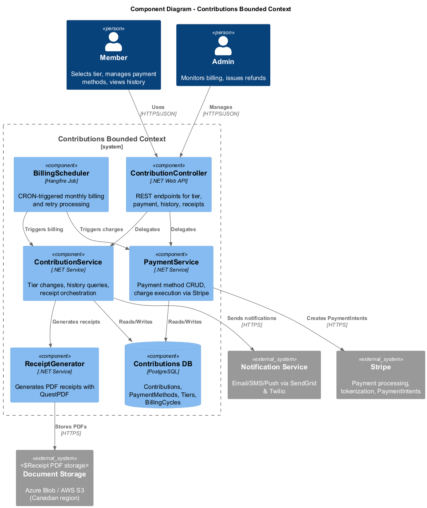
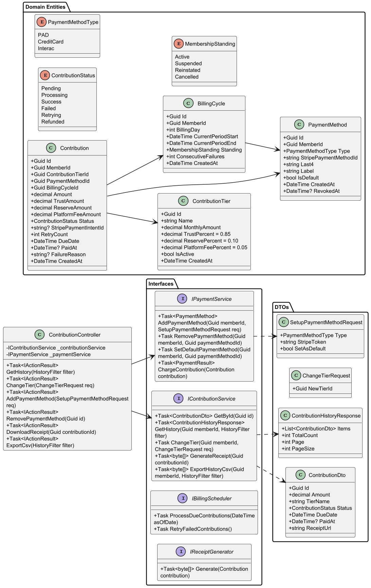
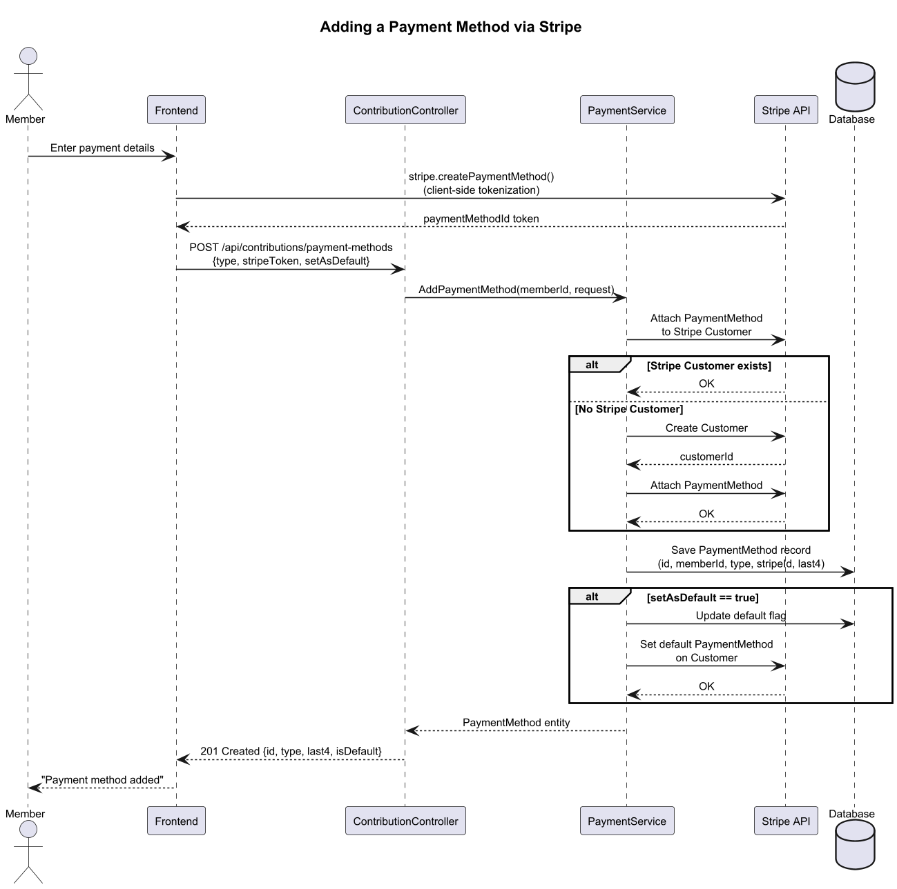
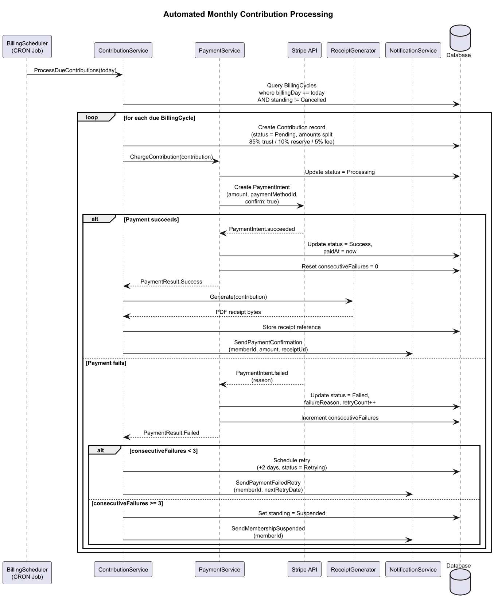
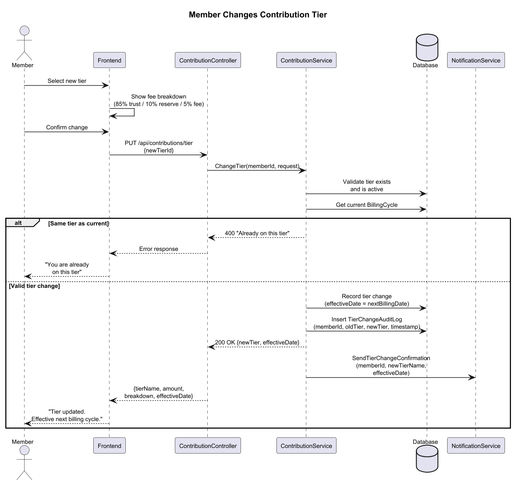
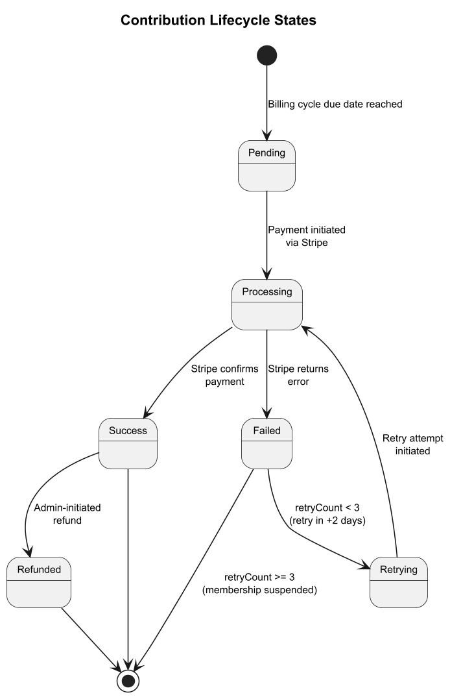
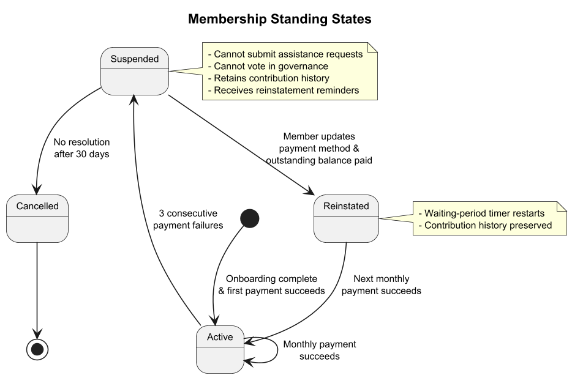

# Contribution Management - Detailed Design

**Feature:** L1-2 Member Contribution Management
**Requirements:** L2-2.1 through L2-2.4
**Last Updated:** 2026-03-29

---

## 1. Feature Scope

The Contribution Management feature enables SafeNetQ members to set up, manage, and track recurring monthly contributions that fund the community mutual aid pool. The feature covers:

- **Tier Selection** -- Members choose from three contribution tiers ($25, $50, or $100/month) with transparent fee breakdowns displayed before confirmation.
- **Payment Method Setup** -- Members add and manage payment methods (Pre-Authorized Debit, credit card, or Interac) via PCI-compliant Stripe Elements tokenization. Raw payment credentials are never stored.
- **Automated Monthly Billing** -- A scheduled job charges each member on their billing anniversary date, with up to 3 retry attempts over 7 days for failed payments.
- **Contribution History** -- Paginated, filterable history of all contributions with date, amount, tier, and status. Exportable as CSV.
- **Receipt Generation** -- PDF receipts generated for each successful contribution, stored in Canadian-region blob storage, and downloadable from the member dashboard.

### Fund Split Logic

Every contribution is split deterministically at charge time:

| Allocation    | Percentage | Purpose                                         |
|---------------|------------|--------------------------------------------------|
| Trust Fund    | 85%        | Pool for emergency assistance payouts            |
| Reserve Fund  | 10%        | Buffer for high-demand periods and sustainability|
| Platform Fee  | 5%         | Operational costs and platform maintenance       |

For a $100/month tier: $85.00 trust, $10.00 reserve, $5.00 platform fee.

---

## 2. Architecture Overview

### 2.1 C4 Component Diagram

### 2.2 Key Components

| Component                | Type            | Responsibility                                                              |
|--------------------------|-----------------|-----------------------------------------------------------------------------|
| **ContributionController** | .NET Web API   | REST endpoints for tier management, payment methods, history, and receipts |
| **ContributionService**    | Domain Service | Tier change logic, history queries, receipt orchestration, billing coordination |
| **PaymentService**         | Domain Service | Payment method CRUD, Stripe PaymentIntent creation, charge execution       |
| **BillingScheduler**       | Hangfire Job   | CRON-triggered daily job that processes due billing cycles and retries      |
| **ReceiptGenerator**       | Infrastructure | Generates PDF receipts using QuestPDF, stores to blob storage              |

### 2.3 External Integrations

| System               | Integration Point                                           |
|----------------------|-------------------------------------------------------------|
| **Stripe**           | Customer management, PaymentMethod attachment, PaymentIntents, refunds |
| **Notification Service** | Email/SMS/Push for payment confirmations, failures, and tier changes |
| **Document Storage** | Azure Blob or AWS S3 (Canadian region) for receipt PDF storage |
| **PostgreSQL**       | Persistent storage for all contribution domain entities     |

---

## 3. Domain Model

### 3.1 Class Diagram

### 3.2 Entities

**ContributionTier** -- Defines available monthly amounts and the split percentages. Three seed tiers ($25, $50, $100) with fixed split ratios (85/10/5). Tiers can be deactivated but not deleted (referential integrity).

**PaymentMethod** -- A tokenized reference to a member's payment instrument. Stores the Stripe PaymentMethod ID, type (PAD/CreditCard/Interac), last-4 digits for display, and a default flag. Soft-deleted via `RevokedAt` timestamp.

**Contribution** -- A single monthly charge record. Contains the full amount and the pre-calculated split amounts (trust, reserve, platform fee). Tracks status through its lifecycle, retry count, Stripe PaymentIntent ID, and failure reason.

**BillingCycle** -- Tracks each member's billing day (anniversary of signup), current period window, membership standing, and consecutive failure count.

### 3.3 Key Enumerations

- **ContributionStatus**: Pending, Processing, Success, Failed, Retrying, Refunded
- **PaymentMethodType**: PAD, CreditCard, Interac
- **MembershipStanding**: Active, Suspended, Reinstated, Cancelled

---

## 4. Behavioral Design

### 4.1 Payment Method Setup

**Flow summary:**
1. The frontend uses Stripe.js to tokenize payment details client-side (PCI-compliant -- raw card/bank data never touches our server).
2. The token is sent to `POST /api/contributions/payment-methods`.
3. PaymentService attaches the PaymentMethod to the member's Stripe Customer (creating the Customer if first payment method).
4. The tokenized reference is persisted in the database.
5. If `setAsDefault` is true, both the local record and Stripe Customer default are updated.

**Security considerations:**
- All payment data is tokenized via Stripe Elements before reaching the backend.
- The backend only stores Stripe PaymentMethod IDs, never raw credentials.
- PAD setup requires a Stripe-hosted mandate acceptance flow.

### 4.2 Automated Monthly Billing

**Flow summary:**
1. BillingScheduler runs daily via Hangfire CRON, querying BillingCycles where `billingDay` matches today and standing is not Cancelled.
2. For each due cycle, a Contribution record is created with status `Pending` and pre-calculated split amounts.
3. PaymentService creates a Stripe PaymentIntent with `confirm: true` using the member's default payment method.
4. On success: status set to `Success`, receipt generated, confirmation notification sent, consecutive failures reset to 0.
5. On failure: status set to `Failed`, `retryCount` incremented.
   - If fewer than 3 consecutive failures: schedule retry in +2 days (status `Retrying`), notify member.
   - If 3 or more consecutive failures: membership standing set to `Suspended`, suspension notification sent.

**Retry schedule:**
- Day 0: Initial charge attempt
- Day 2: First retry
- Day 4: Second retry
- Day 6: Third retry (final)
- Day 7+: If all fail, membership suspended

### 4.3 Tier Change

**Flow summary:**
1. Member selects a new tier on the dashboard; the frontend displays the fee breakdown before confirmation.
2. `PUT /api/contributions/tier` is called with the new tier ID.
3. ContributionService validates the tier exists and is different from the current tier.
4. The change is recorded with an effective date of the next billing cycle start (no proration).
5. An audit log entry is created, and the member receives a confirmation notification.

**Business rules:**
- Tier changes take effect at the start of the next billing period (not mid-cycle).
- There is no limit on how frequently a member can change tiers.
- Tier change history is retained for audit purposes.

---

## 5. State Machines

### 5.1 Contribution Lifecycle

| State       | Description                                                              |
|-------------|--------------------------------------------------------------------------|
| Pending     | Contribution created for billing cycle; payment not yet initiated        |
| Processing  | Stripe PaymentIntent created; awaiting confirmation                      |
| Success     | Payment confirmed by Stripe; receipt generated                           |
| Failed      | Payment declined or errored; may be retried                              |
| Retrying    | Retry scheduled; will transition back to Processing on retry attempt     |
| Refunded    | Admin-initiated refund processed through Stripe                          |

### 5.2 Membership Standing

| State       | Description                                                              |
|-------------|--------------------------------------------------------------------------|
| Active      | Contributions current; full platform access                              |
| Suspended   | 3+ consecutive payment failures; cannot submit assistance requests or vote |
| Reinstated  | Payment method updated and outstanding balance paid; waiting period restarts |
| Cancelled   | No resolution within 30 days of suspension; account deactivated          |

**Suspension effects:**
- Member cannot submit new assistance requests
- Member cannot participate in governance voting
- Contribution history is preserved
- Member receives reinstatement reminder notifications (days 7, 14, 21)

---

## 6. API Endpoints

| Method | Path                                        | Description                        | Auth     |
|--------|---------------------------------------------|------------------------------------|----------|
| GET    | `/api/contributions/tiers`                  | List available contribution tiers  | Member   |
| PUT    | `/api/contributions/tier`                   | Change member's contribution tier  | Member   |
| GET    | `/api/contributions/history`                | Paginated contribution history     | Member   |
| GET    | `/api/contributions/{id}/receipt`            | Download receipt PDF               | Member   |
| GET    | `/api/contributions/export`                 | Export history as CSV              | Member   |
| POST   | `/api/contributions/payment-methods`        | Add a payment method               | Member   |
| GET    | `/api/contributions/payment-methods`        | List member's payment methods      | Member   |
| PUT    | `/api/contributions/payment-methods/{id}/default` | Set default payment method   | Member   |
| DELETE | `/api/contributions/payment-methods/{id}`   | Remove a payment method            | Member   |

---

## 7. Data Model Notes

### 7.1 Database Tables

- **contribution_tiers** -- Seed data: three tiers. `is_active` flag for soft-disable.
- **payment_methods** -- Indexed on `member_id`. Unique constraint on `stripe_payment_method_id`. Soft-delete via `revoked_at`.
- **contributions** -- Indexed on `(member_id, due_date)` and `(status, due_date)` for billing queries. Stores pre-calculated split amounts for audit trail (not re-derived).
- **billing_cycles** -- One row per member. Indexed on `(billing_day, standing)` for the daily scheduler query.
- **tier_change_audit_log** -- Append-only log of tier changes with `member_id`, `old_tier_id`, `new_tier_id`, `effective_date`, `created_at`.

### 7.2 Idempotency

- Each Contribution record has a unique `stripe_payment_intent_id` to prevent double-charging.
- The BillingScheduler checks for existing Pending/Processing contributions for the current period before creating new ones.

### 7.3 Data Residency

All contribution and payment data is stored in Canadian-region infrastructure (Azure Canada Central or AWS ca-central-1) per PIPEDA requirements.

---

## 8. Cross-Cutting Concerns

### 8.1 Notifications

| Event                   | Channel         | Recipient |
|-------------------------|-----------------|-----------|
| Payment succeeded       | Email + Push    | Member    |
| Payment failed (retry)  | Email + Push    | Member    |
| Membership suspended    | Email + Push    | Member    |
| Tier changed            | Email           | Member    |
| Reinstatement reminder  | Email + Push    | Member    |

### 8.2 Audit Trail

All state-changing operations are logged with actor ID, timestamp, previous state, and new state. Tier changes, payment method additions/removals, and membership standing transitions are auditable.

### 8.3 Error Handling

- Stripe API failures are caught and mapped to domain failure reasons.
- Transient failures (network timeouts) are distinguished from permanent failures (card declined) for retry logic.
- The BillingScheduler uses Hangfire's built-in retry with dead-letter queue for infrastructure-level failures.

---

## 9. Traceability

| Requirement | Design Coverage                                      |
|-------------|------------------------------------------------------|
| L2-2.1      | Tier selection: Section 4.3, class diagram, API endpoints |
| L2-2.2      | Payment method setup: Section 4.1, sequence diagram   |
| L2-2.3      | Automated billing: Section 4.2, state diagrams        |
| L2-2.4      | Contribution history: API endpoints, class diagram DTOs |
