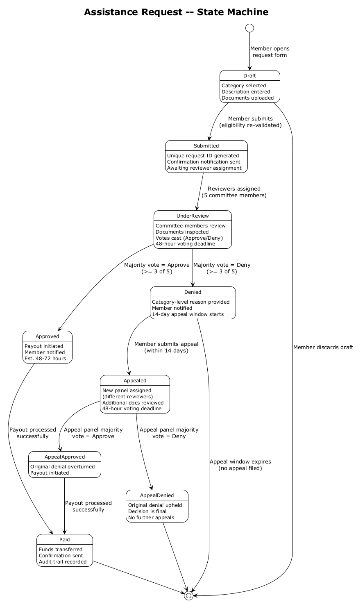
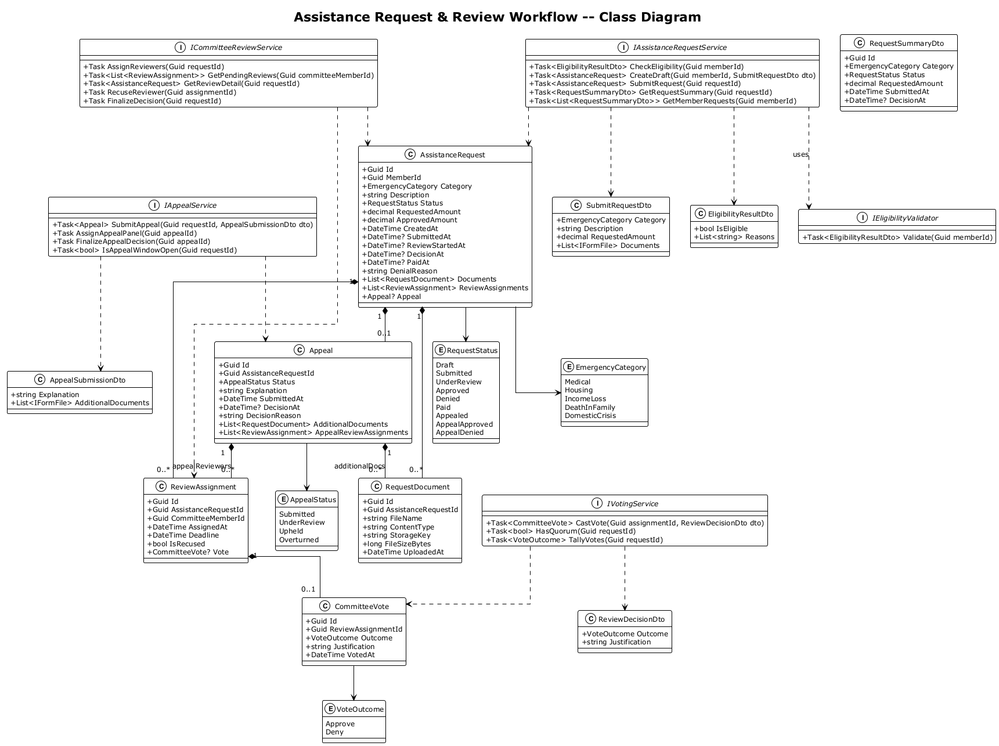
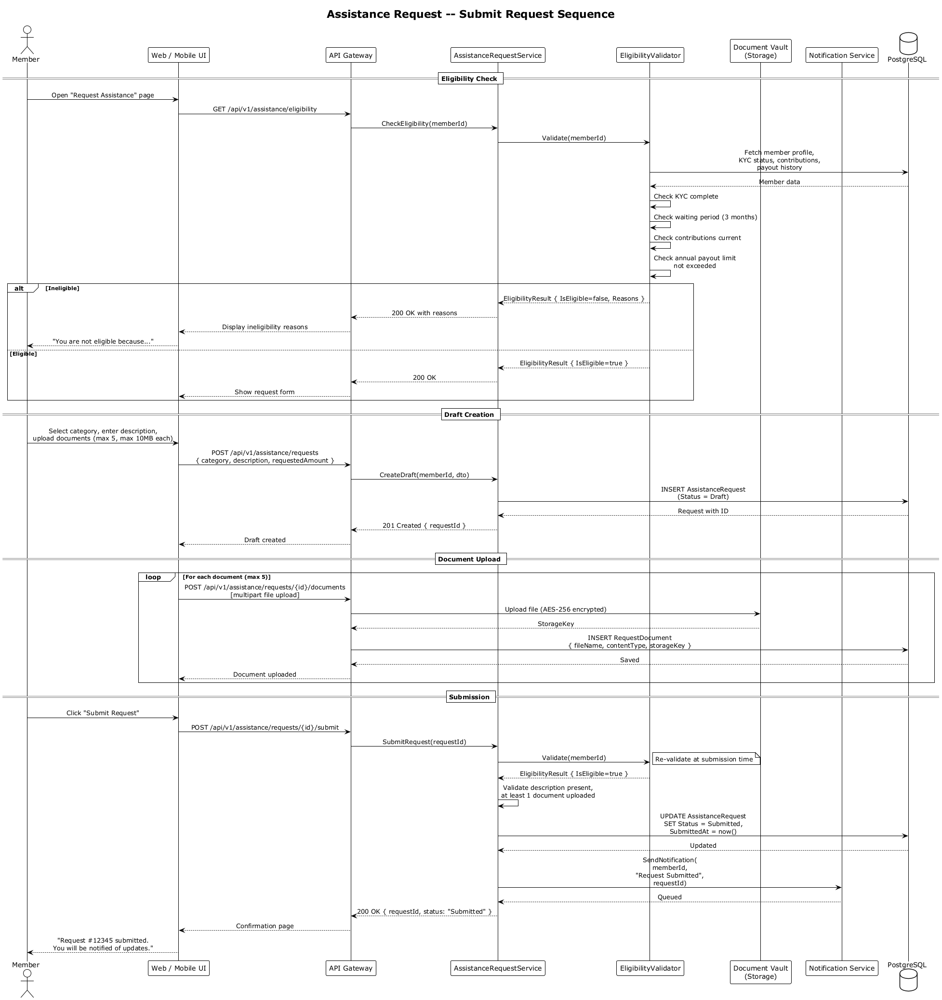
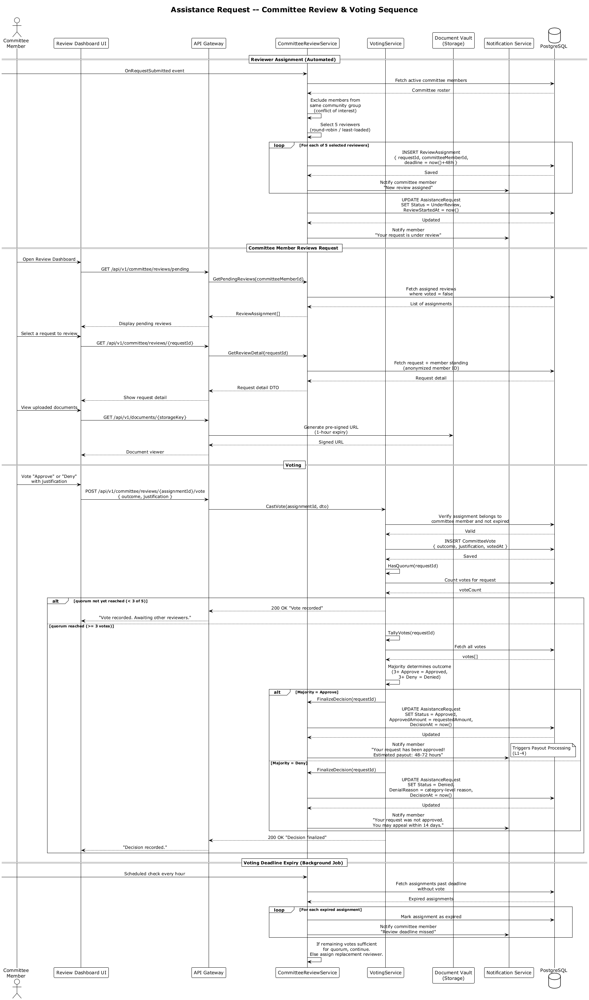
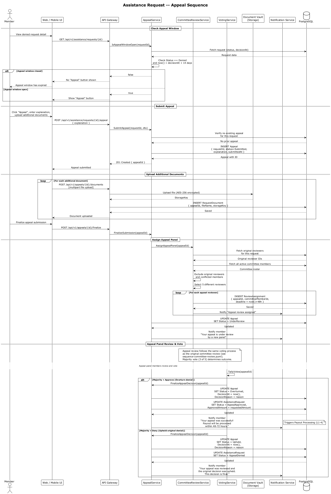
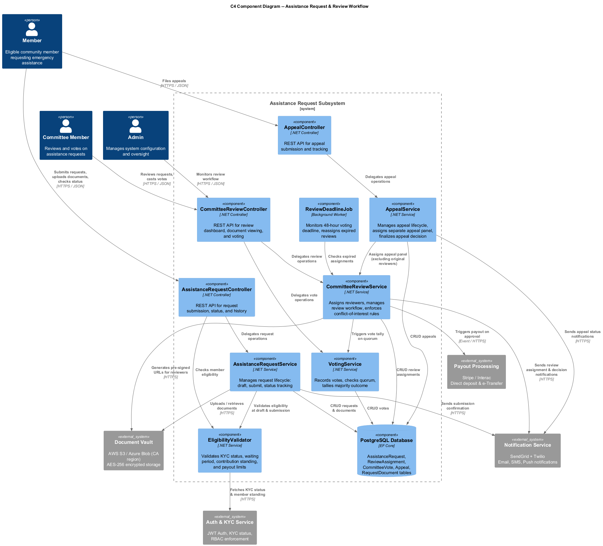

# Assistance Request & Review Workflow -- Detailed Design

**Feature:** L1-3 Assistance Request & Review Workflow
**L2 Requirements:** L2-3.1 through L2-3.4
**Last Updated:** 2026-03-29

---

## 1. Feature Scope

The Assistance Request & Review Workflow enables eligible members of the SafeNetQ Community Emergency Mutual Aid Platform to submit emergency assistance requests and have them evaluated through a transparent, committee-based review process. The feature covers four primary flows:

1. **Request Submission** -- Members select an emergency category, describe their situation, upload supporting documentation, and submit for review.
2. **Committee Review & Voting** -- A panel of five committee members is automatically assigned to each request. Each reviewer examines the request and supporting documents, then casts an Approve or Deny vote with justification. A majority vote (3 of 5) determines the outcome.
3. **Approval & Payout Trigger** -- Approved requests transition to the Payout Processing subsystem (L1-4) for disbursement within 48-72 hours.
4. **Appeals Process** -- Members denied assistance may appeal within 14 days. A separate panel reviews the appeal with any additional documentation. The appeal decision is final and binding.

### Emergency Categories

| Category | Description |
|---|---|
| Medical | Unexpected medical expenses not covered by insurance |
| Housing | Eviction prevention, emergency repairs, temporary shelter |
| Income Loss | Job loss, business closure, disability preventing work |
| Death in Family | Funeral expenses, travel for family bereavement |
| Domestic Crisis | Domestic violence relocation, family emergency situations |

---

## 2. Eligibility Validation

Before a member can submit a request, the system validates all of the following conditions. If any check fails, the member sees a clear explanation of why they are ineligible.

| Check | Rule | Source |
|---|---|---|
| KYC Complete | Member has "Verified" KYC status | Auth & KYC Service |
| Waiting Period Met | At least 3 months since first successful contribution (configurable) | Fund Governance (L2-9.2) |
| Contributions Current | No suspended membership; no 2+ consecutive missed payments | Contribution Management (L2-2.3) |
| Payout Limit Not Exceeded | Fewer than 2 payouts in the rolling 12-month window; annual dollar cap not reached | Payout Processing (L2-4.2) |

Eligibility is checked twice: once when the member opens the request form (early feedback) and again at submission time (prevents race conditions).

---

## 3. Core Components

### 3.1 Service Interfaces

| Service | Responsibility |
|---|---|
| `IAssistanceRequestService` | Request lifecycle management: create draft, submit, query status and history |
| `ICommitteeReviewService` | Reviewer assignment (with conflict-of-interest exclusion), review dashboard, deadline enforcement |
| `IVotingService` | Vote recording, quorum checking, majority tally |
| `IAppealService` | Appeal submission, appeal panel assignment (excluding original reviewers), appeal decision finalization |
| `IEligibilityValidator` | Validates all eligibility preconditions for a given member |

### 3.2 Domain Entities

| Entity | Key Fields |
|---|---|
| `AssistanceRequest` | Id, MemberId, Category, Description, Status, RequestedAmount, ApprovedAmount, timestamps, DenialReason |
| `RequestDocument` | Id, AssistanceRequestId, FileName, ContentType, StorageKey, FileSizeBytes |
| `ReviewAssignment` | Id, AssistanceRequestId, CommitteeMemberId, AssignedAt, Deadline (48h), IsRecused |
| `CommitteeVote` | Id, ReviewAssignmentId, Outcome (Approve/Deny), Justification, VotedAt |
| `Appeal` | Id, AssistanceRequestId, Status, Explanation, additional documents, appeal review assignments |

### 3.3 Background Workers

| Worker | Purpose |
|---|---|
| `ReviewDeadlineJob` | Runs hourly; detects expired review assignments (past 48-hour deadline), marks them expired, notifies the committee member, and assigns a replacement reviewer if quorum is at risk |

---

## 4. Request State Machine

Requests follow a well-defined state machine from creation through final resolution.

**States:** Draft, Submitted, UnderReview, Approved, Denied, Paid, Appealed, AppealApproved, AppealDenied

Key transitions:

- **Draft -> Submitted**: Member completes form and clicks submit; eligibility is re-validated.
- **Submitted -> UnderReview**: System auto-assigns 5 committee reviewers.
- **UnderReview -> Approved/Denied**: Majority vote (3 of 5) determines outcome.
- **Approved -> Paid**: Payout subsystem processes the disbursement.
- **Denied -> Appealed**: Member files appeal within 14-day window.
- **Appealed -> AppealApproved/AppealDenied**: Separate panel votes; decision is final.

---

## 5. Class Diagram

The class diagram shows all domain entities, enumerations, service interfaces, and DTOs for this feature.

---

## 6. Sequence Diagrams

### 6.1 Request Submission

This sequence covers the full member-facing flow: eligibility check, draft creation, document upload, and submission with confirmation.

**Key design decisions:**

- Eligibility is validated at form-load time (for UX) and again at submission time (for correctness).
- Documents are uploaded individually to the Document Vault with AES-256 encryption before the request is finalized.
- A unique request ID is generated at draft creation, not at submission, so documents can reference it during upload.
- Maximum 5 documents, 10 MB each, limited to PDF/JPG/PNG formats.

### 6.2 Committee Review & Voting

This sequence covers automated reviewer assignment, the review dashboard experience, document viewing, vote casting, quorum detection, and decision finalization.

**Key design decisions:**

- **Conflict of interest**: Committee members from the same community group as the requesting member are automatically recused.
- **Anonymized review**: Committee members see an anonymized member identifier, not the member's real name.
- **Quorum**: 3 of 5 votes required. Voting concludes as soon as 3 votes reach the same outcome (early termination).
- **48-hour deadline**: A background job monitors deadlines and reassigns expired slots to maintain quorum.
- **Document access**: Pre-signed URLs with 1-hour expiry are generated per L2-7.1 requirements.

### 6.3 Appeal Process

This sequence covers appeal eligibility check, appeal submission with additional documentation, separate panel assignment, and final decision.

**Key design decisions:**

- Only one appeal is permitted per denied request.
- The appeal panel consists of entirely different reviewers than the original panel.
- The appeal follows the same voting mechanics (5 reviewers, majority vote, 48-hour deadline).
- The appeal decision is final and binding -- no further appeals are allowed.
- A successful appeal transitions the request to AppealApproved and triggers payout processing.

---

## 7. C4 Component Diagram

The component diagram shows how the Assistance Request subsystem is structured internally and how it integrates with external systems.

**External system dependencies:**

| System | Integration Purpose |
|---|---|
| Document Vault (S3/Blob) | Encrypted storage and retrieval of supporting documents |
| Notification Service (SendGrid/Twilio) | Email, SMS, and push notifications for status changes |
| Payout Processing (Stripe/Interac) | Triggered on approval to disburse funds within 48-72 hours |
| Auth & KYC Service | Member eligibility verification (KYC status, membership standing) |

---

## 8. API Endpoints

### 8.1 Member-Facing

| Method | Endpoint | Description |
|---|---|---|
| GET | `/api/v1/assistance/eligibility` | Check current member's eligibility for submitting a request |
| POST | `/api/v1/assistance/requests` | Create a draft assistance request |
| POST | `/api/v1/assistance/requests/{id}/documents` | Upload a supporting document to a draft request |
| POST | `/api/v1/assistance/requests/{id}/submit` | Submit the draft request for review |
| GET | `/api/v1/assistance/requests` | List current member's requests (paginated) |
| GET | `/api/v1/assistance/requests/{id}` | Get detailed status of a specific request |
| POST | `/api/v1/assistance/requests/{id}/appeal` | Submit an appeal for a denied request |
| POST | `/api/v1/appeals/{id}/documents` | Upload additional documents for an appeal |
| POST | `/api/v1/appeals/{id}/finalize` | Finalize appeal submission |

### 8.2 Committee-Facing

| Method | Endpoint | Description |
|---|---|---|
| GET | `/api/v1/committee/reviews/pending` | List pending review assignments for current committee member |
| GET | `/api/v1/committee/reviews/{requestId}` | Get full review detail (anonymized member, documents, standing) |
| POST | `/api/v1/committee/reviews/{assignmentId}/vote` | Cast Approve or Deny vote with justification |
| GET | `/api/v1/documents/{storageKey}` | Retrieve pre-signed URL for document viewing |

---

## 9. Business Rules Summary

1. **Eligibility is enforced at two checkpoints**: form load and submission. This prevents stale eligibility data from allowing ineligible submissions.
2. **Reviewer assignment uses round-robin with conflict-of-interest exclusion**: ensures fair workload distribution and unbiased review.
3. **Majority vote (3 of 5) determines outcome**: once 3 votes agree, the decision is finalized immediately without waiting for remaining votes.
4. **48-hour voting deadline**: ensures timely processing. Expired assignments are replaced automatically.
5. **14-day appeal window**: begins at the denial decision timestamp. Members must act within this window.
6. **One appeal per request**: appeal decisions are final and binding.
7. **Appeal panel exclusion**: no reviewer from the original panel may serve on the appeal panel.
8. **Payout caps enforced at submission and approval**: per-event and annual limits per tier are checked at both stages.
9. **All actions are audit-logged**: committee votes, status changes, document access, and admin actions are recorded per L2-8.4.

---

## 10. Cross-Cutting Concerns

| Concern | Approach |
|---|---|
| **Authentication** | JWT-based; all endpoints require valid access token (L2-14.3) |
| **Authorization** | RBAC: Members access own requests; Committee role required for review endpoints; Admin for configuration (L2-8.5) |
| **Audit Trail** | Every state change, vote, and document access logged with timestamp, user ID, IP address (L2-8.4) |
| **Notifications** | Email + push at each status transition; SMS for payout confirmation (L2-6.2) |
| **Document Security** | AES-256 at rest; pre-signed URLs with 1-hour expiry; Canadian data residency (L2-7.1) |
| **Data Privacy** | Member identity anonymized during committee review; PII handling per PIPEDA (L2-10.3) |
| **Idempotency** | Submission and vote endpoints are idempotent to handle network retries safely |

---

## 11. Diagrams Index

| Diagram | File | Description |
|---|---|---|
| Class Diagram | [class-diagram.puml](class-diagram.puml) / [PNG](class-diagram.png) | Domain entities, services, DTOs |
| Submit Request Sequence | [sequence-submit-request.puml](sequence-submit-request.puml) / [PNG](sequence-submit-request.png) | Member submits an assistance request |
| Committee Review Sequence | [sequence-committee-review.puml](sequence-committee-review.puml) / [PNG](sequence-committee-review.png) | Committee reviews, votes, and decides |
| Appeal Sequence | [sequence-appeal.puml](sequence-appeal.puml) / [PNG](sequence-appeal.png) | Member appeals a denied request |
| Request State Machine | [state-request.puml](state-request.puml) / [PNG](state-request.png) | Request lifecycle states and transitions |
| C4 Component Diagram | [c4-component-assistance.puml](c4-component-assistance.puml) / [PNG](c4-component-assistance.png) | Subsystem architecture and integrations |
