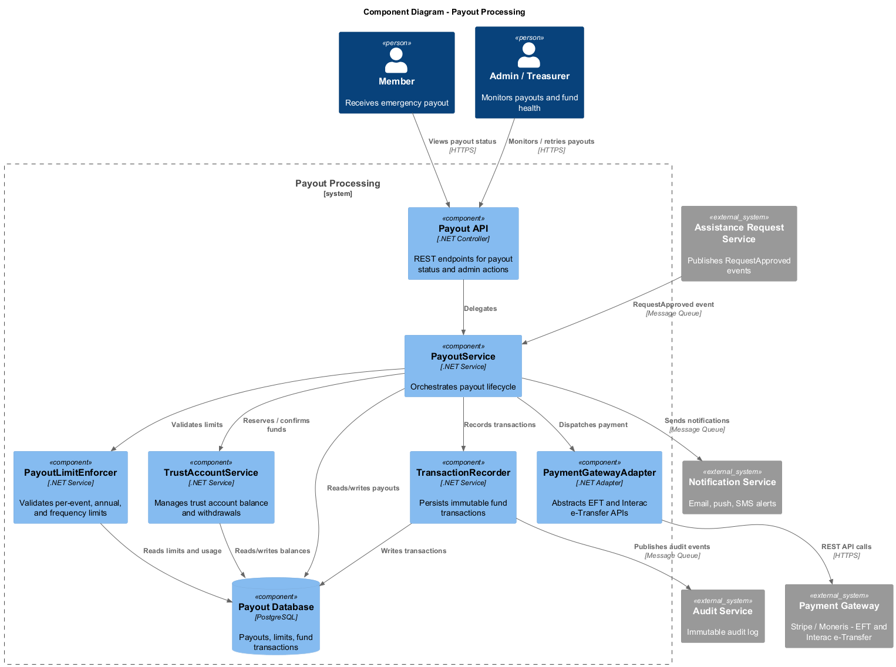
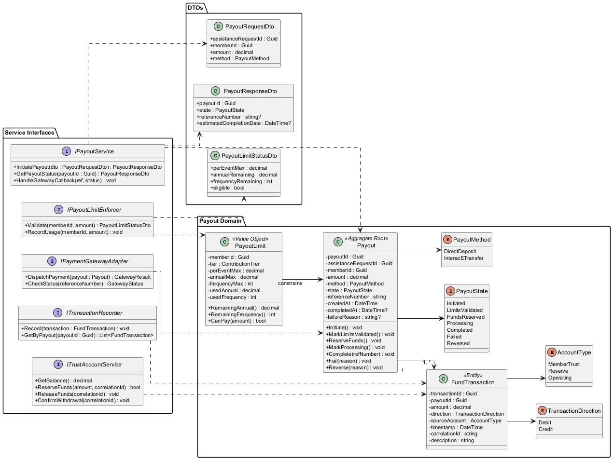
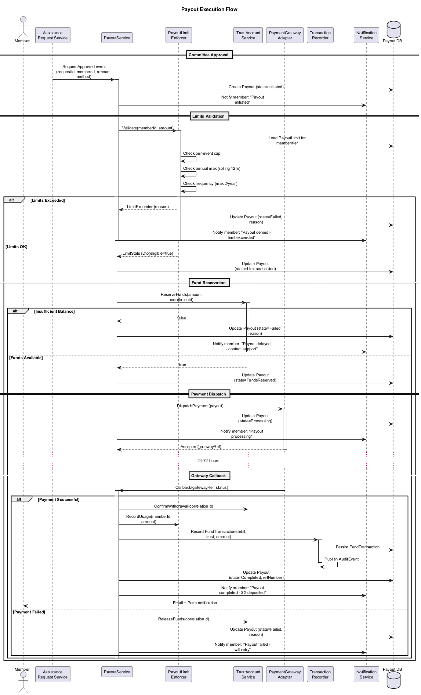
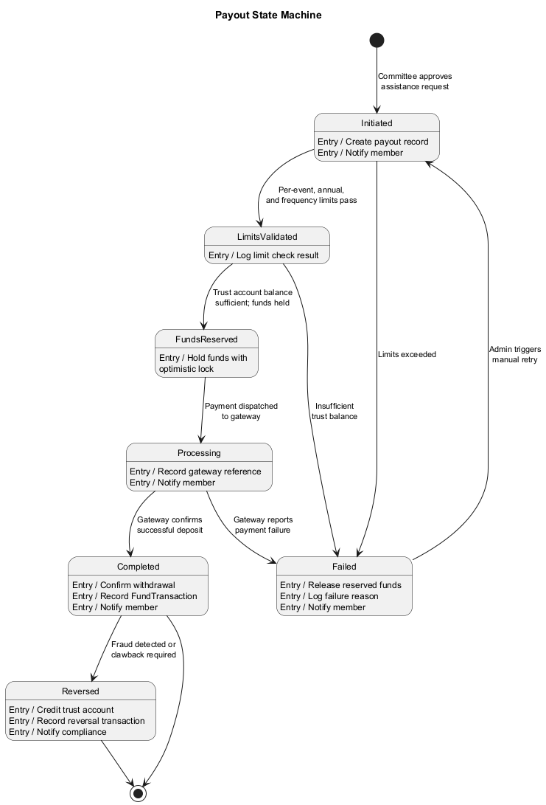

# Payout Processing -- Detailed Design

## 1. Overview

The Payout Processing bounded context handles the disbursement of approved emergency assistance funds to members. After a committee approves an assistance request, this subsystem initiates, validates, executes, and records the payout through either direct deposit or Interac e-Transfer. It enforces per-event and annual limits, draws funds exclusively from the Member Trust Account, and maintains a complete audit trail of every fund movement.

### Key Responsibilities

- Execute payouts via direct deposit (EFT) or Interac e-Transfer within 48-72 hours of approval.
- Enforce per-event caps (tier-based: $2,000-$5,000), annual maximums (rolling 12-month window), and frequency limits (max 2 per 12 months).
- Withdraw funds from the Member Trust Account only; reject if insufficient balance.
- Record every transaction with timestamp, amount, method, and approving committee members.
- Notify the member at each state transition (initiated, processing, completed, failed).

## 2. Component Architecture

### 2.1 Core Components

| Component | Responsibility |
|---|---|
| **PayoutService** | Orchestrates the end-to-end payout flow: validation, limit checks, fund withdrawal, payment dispatch, and status tracking. |
| **PayoutLimitEnforcer** | Evaluates per-event caps, rolling annual maximums, and frequency limits. Returns an allow/deny decision with remaining quota. |
| **TransactionRecorder** | Persists every fund movement as an immutable `FundTransaction` record and publishes domain events for the audit trail. |
| **PaymentGatewayAdapter** | Anti-corruption layer abstracting Interac e-Transfer and EFT provider APIs (Stripe / Moneris). |
| **TrustAccountService** | Manages the Member Trust Account balance, performs withdrawals, and validates sufficient funds. |

### 2.2 Domain Entities

| Entity | Description |
|---|---|
| **Payout** | Aggregate root. Tracks amount, method, state, associated assistance request, and payout reference number. |
| **PayoutLimit** | Value object per member-tier combination. Holds per-event max, annual max, frequency max, and current utilization. |
| **FundTransaction** | Immutable ledger entry. Records amount, direction (debit/credit), source account, timestamp, and correlation ID. |
| **PayoutMethod** | Enum: `DirectDeposit`, `InteracETransfer`. |
| **PayoutState** | Enum: `Initiated`, `LimitsValidated`, `FundsReserved`, `Processing`, `Completed`, `Failed`, `Reversed`. |

## 3. Class Model

## 4. Payout Execution Flow

The sequence below shows the full payout lifecycle starting from committee approval through fund disbursement and notification.

### Flow Summary

1. **AssistanceRequestService** publishes a `RequestApproved` domain event.
2. **PayoutService** receives the event and creates a `Payout` aggregate in `Initiated` state.
3. **PayoutLimitEnforcer** checks per-event cap, annual cap, and frequency limit for the member.
4. **TrustAccountService** verifies sufficient balance and reserves the funds (optimistic lock).
5. **PaymentGatewayAdapter** dispatches the payment via the member's chosen method.
6. On gateway callback (success/failure), **PayoutService** transitions state accordingly.
7. **TransactionRecorder** persists the `FundTransaction` and publishes an audit event.
8. **NotificationService** sends confirmation or failure alert to the member.

## 5. Payout State Machine

| State | Description |
|---|---|
| **Initiated** | Payout created after committee approval. Awaiting limit validation. |
| **LimitsValidated** | Per-event, annual, and frequency limits passed. |
| **FundsReserved** | Trust account balance verified and funds held. |
| **Processing** | Payment dispatched to gateway. Awaiting confirmation. |
| **Completed** | Gateway confirmed successful deposit. Final state. |
| **Failed** | Gateway reported failure or limits/balance check failed. May be retried. |
| **Reversed** | A completed payout was clawed back (e.g., fraud detection). Terminal. |

## 6. Integration Points

| External System | Protocol | Purpose |
|---|---|
| Stripe / Moneris | REST API | EFT and Interac e-Transfer execution |
| Audit Service | Domain Events | Immutable audit log of all fund movements |
| Notification Service | Message Queue | Member alerts (email, push, SMS) |
| Fund Financial Governance | Internal API | Trust account balance and withdrawal |

## 7. Non-Functional Requirements

- **Latency**: Payout initiation must complete within 5 seconds; gateway response SLA is 48-72 hours.
- **Idempotency**: Duplicate gateway callbacks must not create duplicate transactions.
- **Consistency**: Fund reservation uses optimistic concurrency; on conflict, the payout is retried or failed.
- **Auditability**: Every state transition is recorded with actor, timestamp, and reason.
- **Retention**: FundTransaction records retained for minimum 7 years per FINTRAC requirements.
