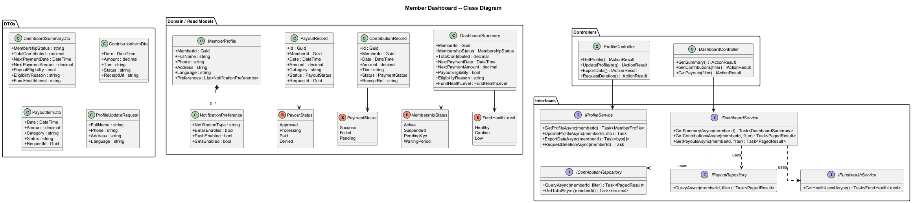
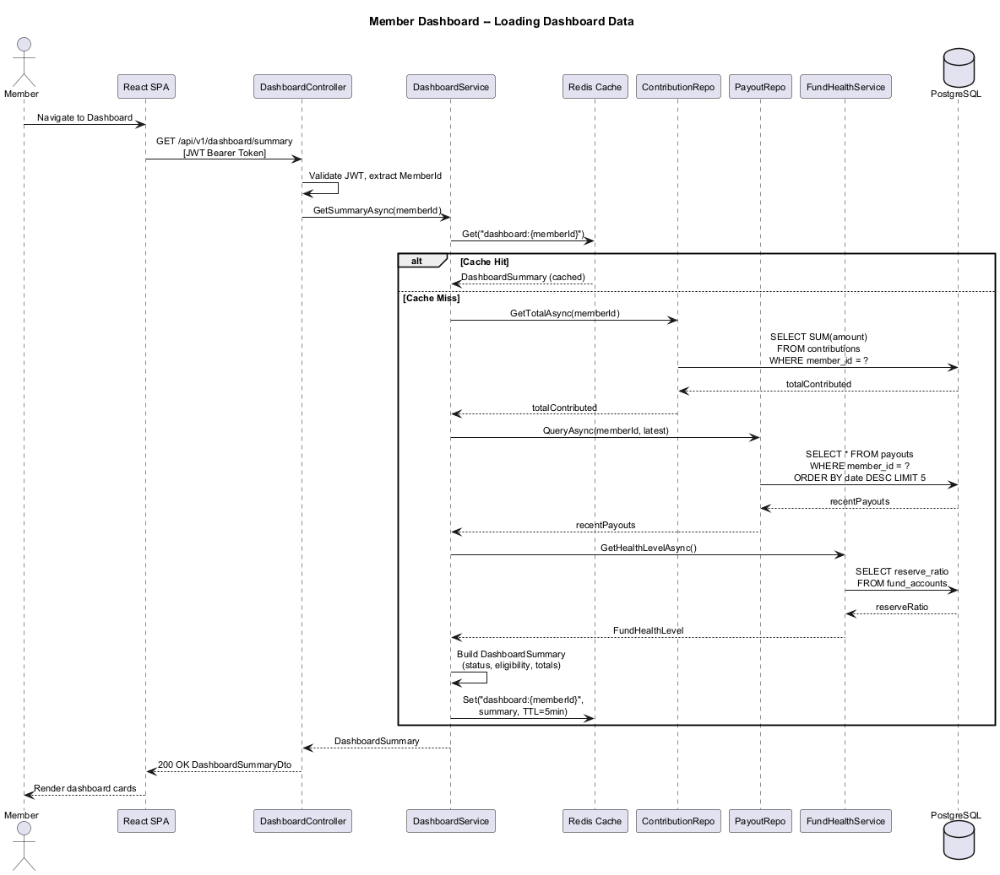
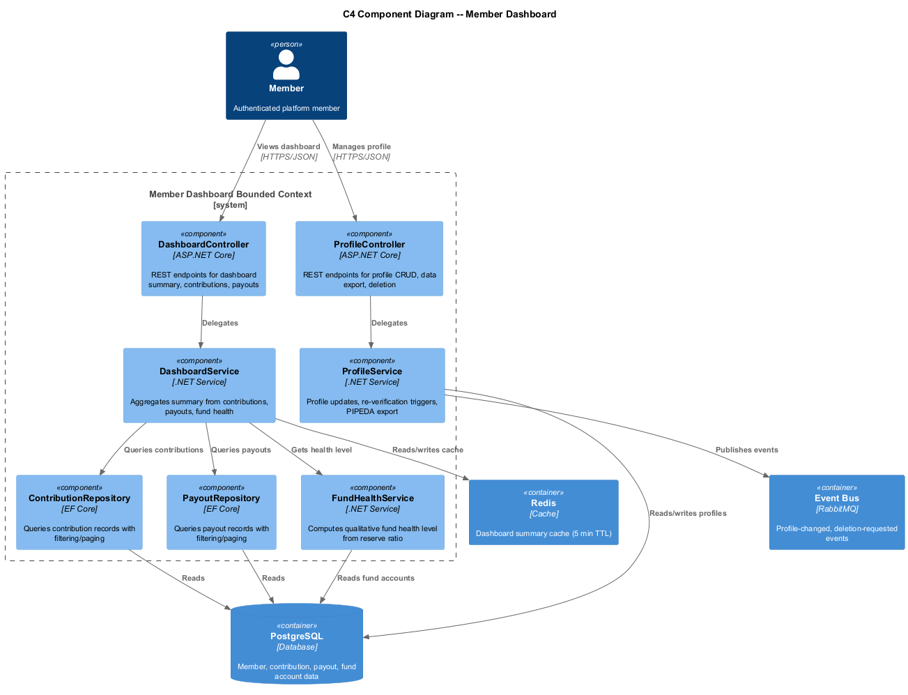

# Member Dashboard -- Detailed Design

## 1. Feature Purpose and Scope

The Member Dashboard is the primary interface for SafeNetQ members after login. It aggregates membership status, contribution history, payout history, fund health indicators, and profile management into a single, accessible view. The dashboard drives member engagement and provides transparency into the mutual-aid fund.

### In Scope

| Capability | Description |
|---|---|
| **Dashboard Overview** | Card-based summary of membership standing, total contributed, next payment, payout eligibility, and fund health. |
| **Contribution History View** | Paginated, filterable list of all contributions with receipt download and CSV export. |
| **Payout History View** | List of past payouts with date, amount, category, status, and request timeline detail. |
| **Profile Management** | Edit personal info, notification preferences, language settings, data export, and account deletion request. |

### Out of Scope

- Admin/committee dashboards (covered by Feature 08).
- Assistance request submission form (covered by Feature 03).
- Real-time chat or messaging.

---

## 2. Technology Choices

| Layer | Technology | Rationale |
|---|---|---|
| Runtime | **.NET 8+** | LTS, high performance, consistent with platform stack. |
| Architecture | **Clean Architecture** | Domain-centric, testable, framework-agnostic core. |
| Frontend | **React 18 + TypeScript** | Component-based UI with strong typing. |
| State Management | **React Query (TanStack Query)** | Server-state caching, background refetch, pagination support. |
| API Layer | **ASP.NET Core Minimal APIs** | Lightweight endpoints with OpenAPI generation. |
| Database | **PostgreSQL 16** | JSONB for flexible profile data, efficient aggregation queries. |
| Caching | **Redis 7** | Cache dashboard summary to reduce DB load on high-traffic page. |

---

## 3. Security Considerations

1. **Authorization** -- All dashboard endpoints require a valid JWT with `Member` role claim. Members can only access their own data.
2. **Data Minimization** -- Fund health indicator shows qualitative level (Healthy/Caution/Low) not exact balances.
3. **PIPEDA Compliance** -- Data export endpoint returns all PII in JSON/CSV. Deletion request triggers a 30-day workflow.
4. **Rate Limiting** -- Dashboard load: 30 requests/minute per user. CSV export: 5 requests/hour per user.
5. **Input Validation** -- Profile updates validated server-side; address changes trigger re-verification flag.

---

## 4. Key Components

### 4.1 Domain Entities

| Entity | Purpose |
|---|---|
| `DashboardSummary` | Read model aggregating membership status, contribution totals, next payment, eligibility, and fund health level. |
| `ContributionRecord` | Contribution date, amount, tier, status, receipt reference. |
| `PayoutRecord` | Payout date, amount, category, status, request ID link. |
| `MemberProfile` | Editable profile fields: name, phone, address, language, notification preferences. |
| `NotificationPreference` | Per-channel (email/push/SMS) toggle for each notification type. |

### 4.2 Interfaces (Ports)

| Interface | Responsibility |
|---|---|
| `IDashboardService` | GetSummary, GetContributionHistory, GetPayoutHistory. |
| `IProfileService` | GetProfile, UpdateProfile, ExportData, RequestDeletion. |
| `IContributionRepository` | Query contributions by member with filtering and pagination. |
| `IPayoutRepository` | Query payouts by member with filtering and pagination. |
| `IFundHealthService` | GetFundHealthLevel -- returns qualitative health indicator. |

### 4.3 Application Services

| Service | Notes |
|---|---|
| `DashboardService : IDashboardService` | Orchestrates summary aggregation from contributions, payouts, and fund health. Caches result in Redis (TTL 5 min). |
| `ProfileService : IProfileService` | Handles profile CRUD, triggers re-verification events, generates data export, queues deletion. |

### 4.4 Controllers (API Layer)

| Controller | Key Endpoints |
|---|---|
| `DashboardController` | `GET /api/v1/dashboard/summary`, `GET /api/v1/dashboard/contributions`, `GET /api/v1/dashboard/payouts` |
| `ProfileController` | `GET /api/v1/profile`, `PUT /api/v1/profile`, `POST /api/v1/profile/export`, `POST /api/v1/profile/delete-request` |

### 4.5 View Models / DTOs

| DTO | Direction | Fields (summary) |
|---|---|---|
| `DashboardSummaryDto` | Out | MembershipStatus, TotalContributed, NextPaymentDate, NextPaymentAmount, PayoutEligibility, EligibilityReason, FundHealthLevel |
| `ContributionPageDto` | Out | Items[], TotalCount, Page, PageSize |
| `ContributionItemDto` | Out | Date, Amount, Tier, Status, ReceiptUrl |
| `PayoutPageDto` | Out | Items[], TotalCount, Page, PageSize |
| `PayoutItemDto` | Out | Date, Amount, Category, Status, RequestId |
| `ProfileDto` | In/Out | FullName, Phone, Address, Language, NotificationPreferences[] |
| `ProfileUpdateRequest` | In | FullName, Phone, Address, Language |

---

## 5. Diagrams

### 5.1 Class Diagram

### 5.2 Dashboard Load Sequence

### 5.3 C4 Component Diagram -- Member Dashboard

