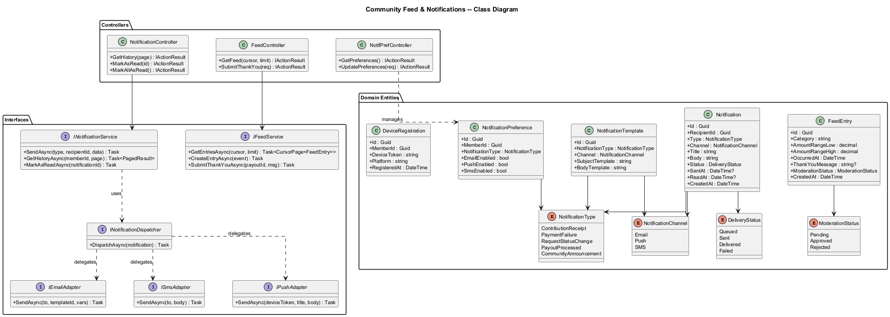
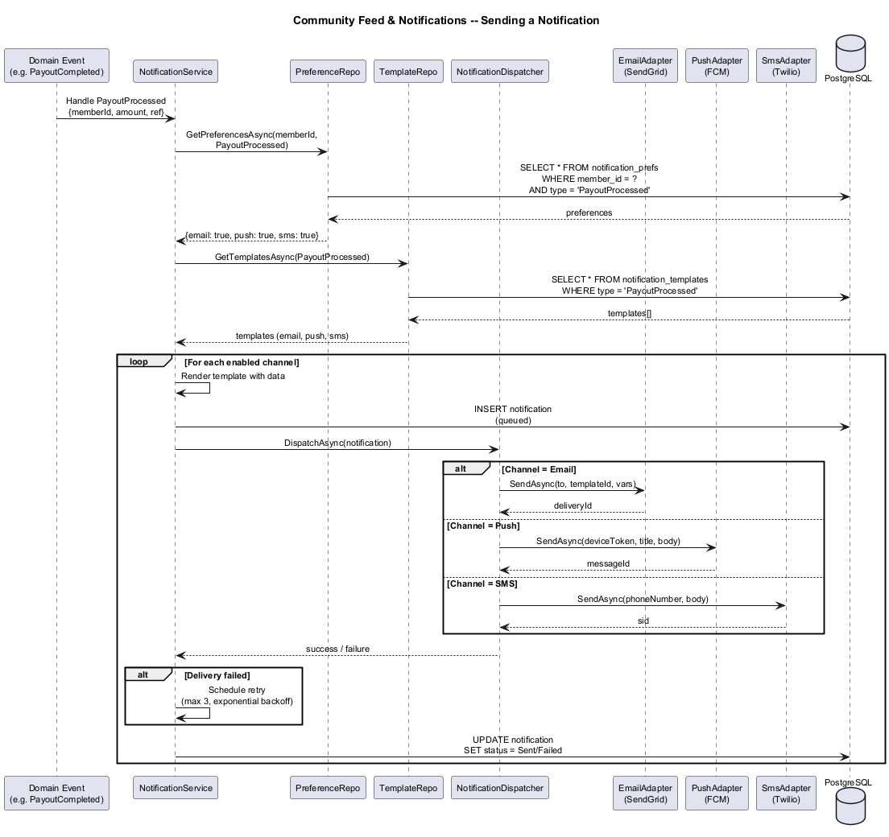
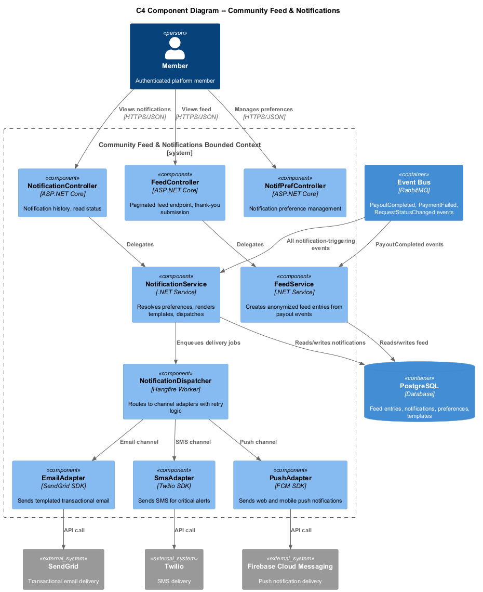

# Community Feed & Notifications -- Detailed Design

## 1. Feature Purpose and Scope

The Community Feed & Notifications feature builds trust and transparency by showing anonymized assistance events and delivering timely notifications across email, push, and SMS channels. The feed demonstrates that the mutual-aid fund is actively helping members, while the notification system keeps members informed of contribution receipts, request status changes, payment issues, and community announcements.

### In Scope

| Capability | Description |
|---|---|
| **Anonymized Community Feed** | Paginated feed of assistance events with category and amount range -- no PII exposed. |
| **Optional Thank-You Messages** | Recipients may opt in to post a reviewed, PII-scrubbed thank-you note. |
| **Multi-Channel Notifications** | Email (SendGrid), push (FCM/APNs), and SMS (Twilio) for key platform events. |
| **Notification Preferences** | Per-event-type, per-channel toggles managed in member profile. |
| **Notification History** | In-app list of past notifications with read/unread state. |

### Out of Scope

- Real-time chat or direct messaging between members.
- Social features (likes, comments on feed entries).
- Admin broadcast scheduling UI (covered by Feature 08).

---

## 2. Technology Choices

| Layer | Technology | Rationale |
|---|---|---|
| Runtime | **.NET 8+** | Consistent platform stack. |
| Feed Storage | **PostgreSQL 16** | Append-only feed table with cursor-based pagination. |
| Notification Dispatch | **Background worker (Hangfire)** | Reliable, retryable async job processing for multi-channel delivery. |
| Email | **SendGrid** | Transactional email with template support and delivery tracking. |
| SMS | **Twilio** | Programmable SMS with delivery receipts. |
| Push | **Firebase Cloud Messaging (FCM)** | Cross-platform push for web and mobile. |
| Event Bus | **RabbitMQ** | Decoupled event-driven notification triggering. |

---

## 3. Security Considerations

1. **Anonymization** -- Feed entries never contain names, IDs, or any PII. Amount is shown as a range (e.g., "$1,000-$2,000").
2. **Thank-You Review** -- Optional thank-you messages are reviewed by a moderator and scrubbed for PII before publication.
3. **Channel Security** -- SMS reserved for critical alerts only (payment failure, payout processed) to minimize cost and avoid spam.
4. **Unsubscribe Compliance** -- Email notifications include CASL-compliant unsubscribe link. Preferences are respected server-side.
5. **Rate Limiting** -- Maximum 10 notifications per member per hour across all channels to prevent flooding.

---

## 4. Key Components

### 4.1 Domain Entities

| Entity | Purpose |
|---|---|
| `FeedEntry` | Anonymized event: category, amount range, date, optional thank-you message, moderation status. |
| `Notification` | Individual notification instance: type, channel, recipient, payload, status, sent/read timestamps. |
| `NotificationPreference` | Per-member, per-event-type channel toggles (email/push/SMS). |
| `NotificationTemplate` | Reusable template per event type and channel with variable placeholders. |
| `DeviceRegistration` | FCM/APNs device token linked to a member for push delivery. |

### 4.2 Interfaces (Ports)

| Interface | Responsibility |
|---|---|
| `IFeedService` | GetFeedEntries (cursor-paginated), CreateFeedEntry, SubmitThankYou. |
| `INotificationService` | Send, GetHistory, MarkAsRead. |
| `INotificationDispatcher` | Dispatches to the correct channel adapter based on preference. |
| `IEmailAdapter` | SendGrid adapter -- send templated email. |
| `ISmsAdapter` | Twilio adapter -- send SMS. |
| `IPushAdapter` | FCM adapter -- send push notification. |
| `INotificationPreferenceRepository` | CRUD for member notification preferences. |

### 4.3 Application Services

| Service | Notes |
|---|---|
| `FeedService : IFeedService` | Listens for `PayoutCompleted` events, creates anonymized feed entries. Handles thank-you submission and moderation queue. |
| `NotificationService : INotificationService` | Receives domain events, resolves preferences, fans out to dispatcher. Stores notification history. |
| `NotificationDispatcher : INotificationDispatcher` | Routes to email/SMS/push adapters. Retries on transient failure (3 attempts, exponential backoff). |

### 4.4 Controllers (API Layer)

| Controller | Key Endpoints |
|---|---|
| `FeedController` | `GET /api/v1/feed?cursor=&limit=`, `POST /api/v1/feed/thank-you` |
| `NotificationController` | `GET /api/v1/notifications?page=&size=`, `PUT /api/v1/notifications/{id}/read`, `PUT /api/v1/notifications/read-all` |
| `NotificationPreferenceController` | `GET /api/v1/notification-preferences`, `PUT /api/v1/notification-preferences` |

### 4.5 DTOs

| DTO | Direction | Fields (summary) |
|---|---|---|
| `FeedEntryDto` | Out | Category, AmountRange, Date, ThankYouMessage (nullable) |
| `ThankYouRequest` | In | PayoutId, Message |
| `NotificationDto` | Out | Id, Type, Title, Body, Channel, SentAt, ReadAt |
| `NotificationPreferenceDto` | In/Out | NotificationType, EmailEnabled, PushEnabled, SmsEnabled |

---

## 5. Diagrams

### 5.1 Class Diagram

### 5.2 Notification Sending Sequence

### 5.3 C4 Component Diagram -- Notifications

