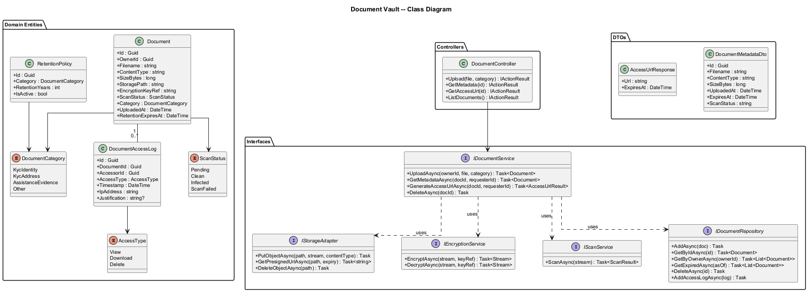
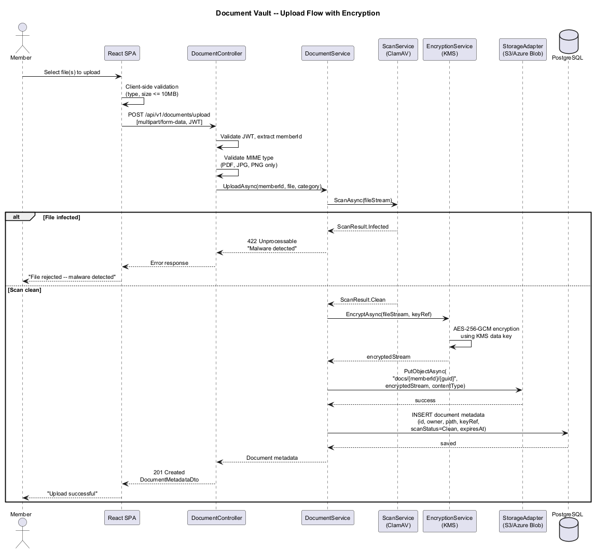
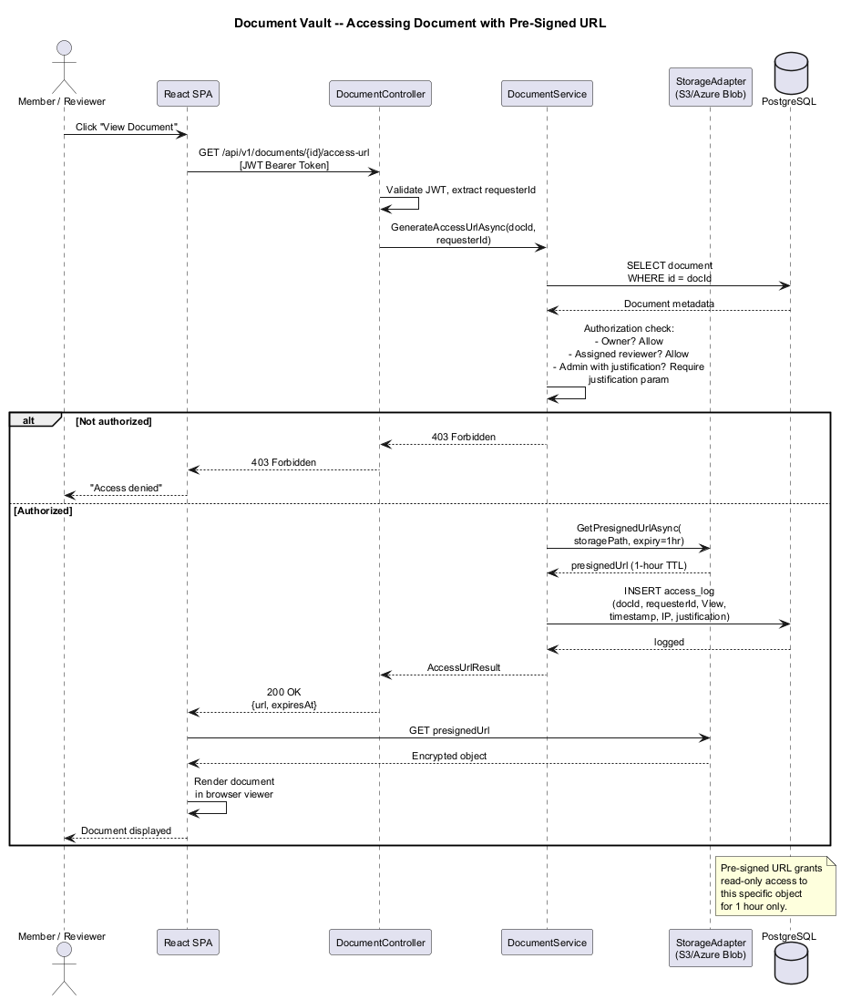
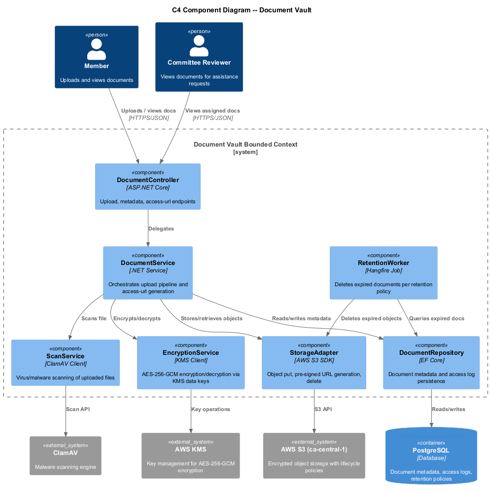

# Document Vault -- Detailed Design

## 1. Feature Purpose and Scope

The Document Vault provides secure, encrypted storage for member-uploaded documents such as government-issued IDs, proof of address, and assistance-request supporting evidence. All documents are encrypted at rest with AES-256, stored in Canadian data centers, and accessed exclusively through time-limited pre-signed URLs. The vault enforces FINTRAC retention requirements and PIPEDA data-minimization principles.

### In Scope

| Capability | Description |
|---|---|
| **Secure Upload** | Client-side file selection, server-side virus scan, AES-256 encryption, storage in Canadian-region cloud. |
| **Time-Limited Access** | Pre-signed URLs with 1-hour expiry for viewing documents in-browser. |
| **Access Control** | Only the owning member, assigned committee reviewers, and admins with audit justification can access. |
| **Retention Policies** | Documents retained for 5 years per FINTRAC, then auto-deleted via lifecycle rules. |
| **Malware Scanning** | Every upload scanned before encryption and storage. |

### Out of Scope

- Document OCR or data extraction (handled by KYC provider).
- Bulk document migration tooling.
- Document versioning or collaborative editing.

---

## 2. Technology Choices

| Layer | Technology | Rationale |
|---|---|---|
| Runtime | **.NET 8+** | Consistent platform stack. |
| Cloud Storage | **AWS S3 (ca-central-1)** or **Azure Blob (Canada Central)** | Canadian data residency, server-side encryption, lifecycle policies. |
| Encryption | **AES-256-GCM** (SSE-KMS or client-side via AWS KMS / Azure Key Vault) | Meets FINTRAC and PIPEDA encryption requirements. |
| Virus Scanning | **ClamAV** (self-hosted) or **AWS S3 Object Lambda + ClamAV** | Scans uploads before they reach permanent storage. |
| Pre-Signed URLs | **AWS S3 Presigned URLs** or **Azure Blob SAS tokens** | Time-limited, scoped access without exposing storage credentials. |
| Database | **PostgreSQL 16** | Document metadata, access logs, retention tracking. |

---

## 3. Security Considerations

1. **Encryption at Rest** -- All documents encrypted with AES-256-GCM using per-tenant keys managed in AWS KMS or Azure Key Vault. Keys rotate annually.
2. **Encryption in Transit** -- TLS 1.3 enforced on all upload and download paths.
3. **Access Control** -- Pre-signed URLs scoped to specific object key; URL generation requires authorization check (owner, assigned reviewer, or admin with justification).
4. **Audit Logging** -- Every access (view, download) logged with actor, timestamp, IP, and justification reason for admin access.
5. **Malware Prevention** -- Uploads quarantined in a staging bucket, scanned by ClamAV, moved to permanent bucket only if clean.
6. **Retention & Deletion** -- Lifecycle policy auto-deletes objects after 5 years. Manual deletion blocked except through PIPEDA deletion-request workflow.
7. **File Validation** -- Accept only PDF, JPG, PNG. Max 10 MB per file. Max 5 files per request. MIME type validated server-side.

---

## 4. Key Components

### 4.1 Domain Entities

| Entity | Purpose |
|---|---|
| `Document` | Metadata record: owner, filename, content type, size, encryption key ref, storage path, upload date, retention expiry, scan status. |
| `DocumentAccessLog` | Immutable log entry: document ID, accessor ID, access type, timestamp, IP, justification. |
| `RetentionPolicy` | Configurable retention duration per document category (default 5 years). |

### 4.2 Interfaces (Ports)

| Interface | Responsibility |
|---|---|
| `IDocumentService` | Upload, GetMetadata, GenerateAccessUrl, Delete (PIPEDA workflow only). |
| `IStorageAdapter` | PutObject, GetPresignedUrl, DeleteObject -- abstracts S3/Azure Blob. |
| `IEncryptionService` | Encrypt/decrypt streams using KMS-managed keys. |
| `IScanService` | ScanFile -- returns clean/infected verdict. |
| `IDocumentRepository` | CRUD for Document metadata and access logs. |

### 4.3 Application Services

| Service | Notes |
|---|---|
| `DocumentService : IDocumentService` | Orchestrates upload pipeline: validate, scan, encrypt, store, record metadata. Generates pre-signed URLs with access logging. |
| `RetentionWorker` | Hangfire recurring job: queries expired documents, deletes from storage and DB. |

### 4.4 Controllers (API Layer)

| Controller | Key Endpoints |
|---|---|
| `DocumentController` | `POST /api/v1/documents/upload`, `GET /api/v1/documents/{id}`, `GET /api/v1/documents/{id}/access-url`, `GET /api/v1/documents` |

### 4.5 DTOs

| DTO | Direction | Fields (summary) |
|---|---|---|
| `UploadRequest` | In | File (multipart), Category, Description |
| `DocumentMetadataDto` | Out | Id, Filename, ContentType, SizeBytes, UploadedAt, ExpiresAt, ScanStatus |
| `AccessUrlResponse` | Out | Url, ExpiresAt |

---

## 5. Diagrams

### 5.1 Class Diagram

### 5.2 Upload Flow Sequence

### 5.3 Document Access Sequence

### 5.4 C4 Component Diagram -- Document Vault

