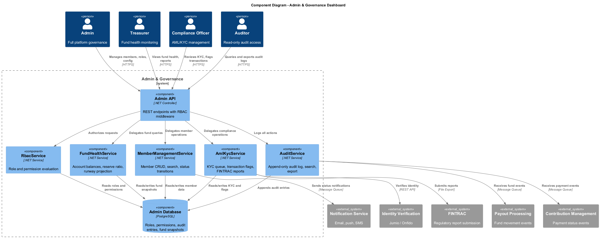
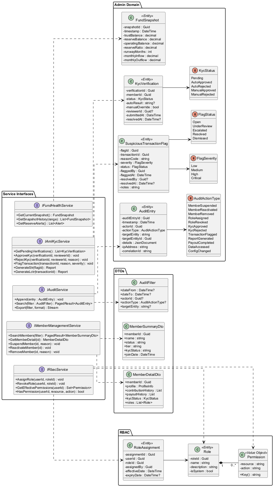
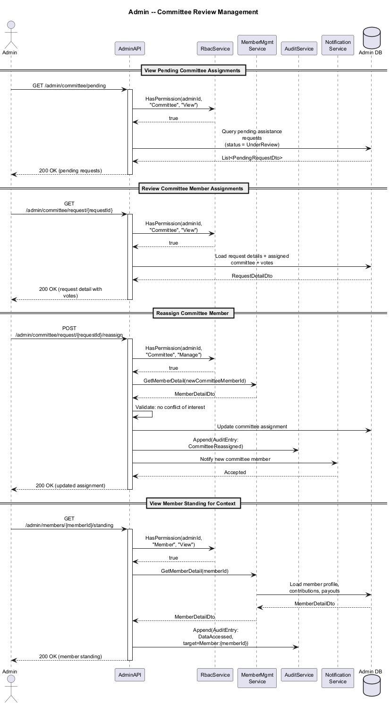
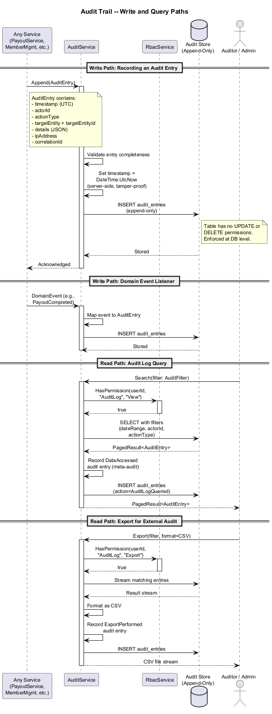
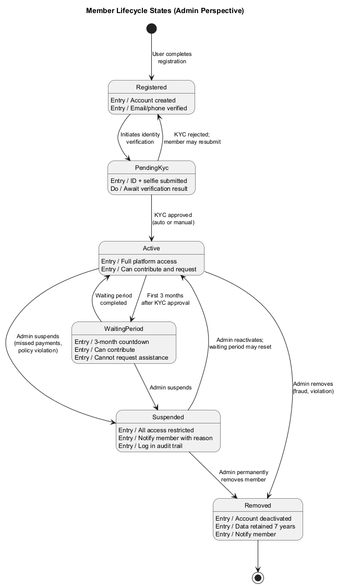

# Admin & Governance Dashboard -- Detailed Design

## 1. Overview

The Admin & Governance Dashboard bounded context provides administrative interfaces for fund health monitoring, member management, AML/KYC compliance, immutable audit trails, and role-based access control (RBAC). It serves Admins, Treasurers, Committee Members, Compliance Officers, and Auditors with the tools needed to govern the SafeNetQ mutual aid platform transparently and in compliance with FINTRAC and PIPEDA regulations.

### Key Responsibilities

- Display real-time fund health metrics: trust/reserve/operating balances, inflow/outflow trends, and runway projections.
- Enable member search, profile review, suspension, reactivation, and removal with mandatory audit logging.
- Provide AML/KYC queue management, suspicious transaction flagging, and FINTRAC report generation.
- Maintain an append-only audit trail of all fund movements, committee decisions, admin actions, and data access events.
- Enforce RBAC with six predefined roles and granular per-resource permissions.

## 2. Component Architecture

### 2.1 Core Components

| Component | Responsibility |
|---|---|
| **FundHealthService** | Aggregates account balances, calculates reserve ratios, projects runway, and triggers low-reserve alerts. |
| **MemberManagementService** | CRUD operations on member profiles, status transitions (active/suspended/removed), and search/filter. |
| **AmlKycService** | Manages KYC verification queue, suspicious transaction flagging, and FINTRAC report generation (STR, LCTR). |
| **AuditService** | Appends immutable audit entries, supports search/filter/export, and enforces 7-year retention. |
| **RbacService** | Manages roles, permissions, and role assignments. Evaluates access decisions at request time. |
| **AdminApiController** | REST API layer exposing all admin operations with RBAC middleware. |

### 2.2 Domain Entities

| Entity | Description |
|---|---|
| **FundSnapshot** | Point-in-time snapshot of trust, reserve, and operating account balances with computed metrics (reserve ratio, runway months). |
| **AuditEntry** | Immutable record: timestamp, actor ID, action type, target entity, details JSON, IP address, correlation ID. |
| **Role** | Named role (Admin, Committee Member, Treasurer, Auditor, Compliance Officer, Member) with associated permissions. |
| **Permission** | Granular capability: resource + action (e.g., `Member:Suspend`, `AuditLog:Export`, `FundHealth:View`). |
| **RoleAssignment** | Links a user to one or more roles with effective/expiry dates. |
| **KycVerification** | Tracks a member's KYC status, auto-verification result, manual override, and reviewer ID. |
| **SuspiciousTransactionFlag** | Flag on a transaction with reason code, severity, and resolution status. |

## 3. Class Model

## 4. Key Flows

### 4.1 Committee Review from Admin Perspective

This flow shows an admin navigating the committee review interface, reviewing a pending assistance request, and managing committee assignments.

### 4.2 Audit Trail Creation and Query

Every admin action, fund movement, and data access event is captured as an immutable audit entry. This flow shows both write and read paths.

## 5. Member Lifecycle State Machine

From the admin perspective, a member transitions through several states based on KYC completion, payment standing, and administrative actions.

| State | Description |
|---|---|
| **Registered** | Account created; email/phone verified. |
| **PendingKyc** | Awaiting identity verification submission or result. |
| **Active** | KYC verified, contributions current. Eligible after waiting period. |
| **WaitingPeriod** | Active but within the 3-month eligibility waiting period. |
| **Suspended** | Admin-suspended (missed payments, policy violation). Cannot contribute or request. |
| **Removed** | Permanently removed by admin. Data retained per FINTRAC (7 years). |

## 6. RBAC Model

### 6.1 Role Hierarchy

| Role | Key Permissions |
|---|---|
| **Admin** | Full access: member management, role assignment, fund health, audit export, system configuration. |
| **Treasurer** | Fund health dashboards, account balances, financial reports, payout monitoring. |
| **Committee Member** | Review assistance requests, cast votes, view anonymized member standing. |
| **Compliance Officer** | KYC management, suspicious transaction review, FINTRAC report generation. |
| **Auditor** | Read-only access to audit trail, financial reports, and compliance dashboards. |
| **Member** | Self-service dashboard, contribution management, assistance requests. |

### 6.2 Permission Evaluation

Permissions are evaluated as: `Role(s) -> Permission Set -> Resource:Action`. A user may hold multiple roles; the effective permission set is the union. All access denials are logged.

## 7. Integration Points

| External System | Protocol | Purpose |
|---|---|
| Identity Verification Provider | REST API | Jumio/Onfido for automated KYC checks |
| FINTRAC | File Export | STR and LCTR report submission |
| Notification Service | Message Queue | Admin alerts, member status change notifications |
| Payout Processing | Domain Events | Fund movement events for audit trail |
| Contribution Management | Domain Events | Payment events for member standing |

## 8. Non-Functional Requirements

- **Audit Immutability**: Audit entries are append-only; no update or delete operations permitted at any layer.
- **Retention**: Audit logs and member data retained for minimum 7 years.
- **Performance**: Admin dashboards load within 3 seconds; audit search returns within 5 seconds for queries spanning up to 1 year.
- **Availability**: Admin dashboard targets 99.9% uptime during business hours.
- **Security**: All admin endpoints require MFA. Session timeout is 15 minutes for admin roles.
