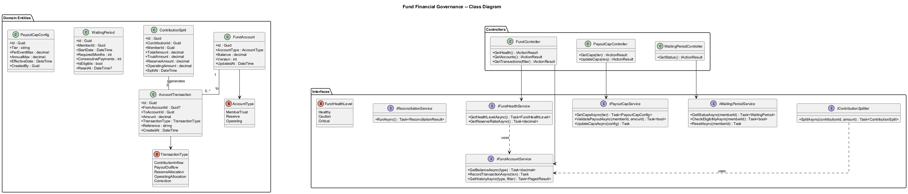
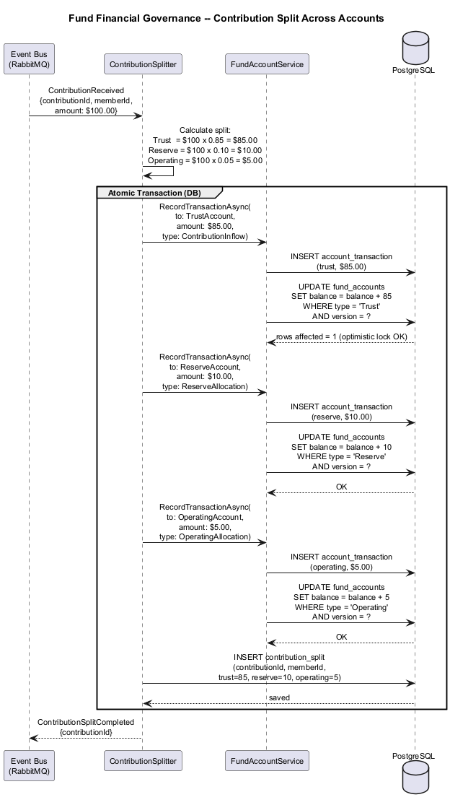
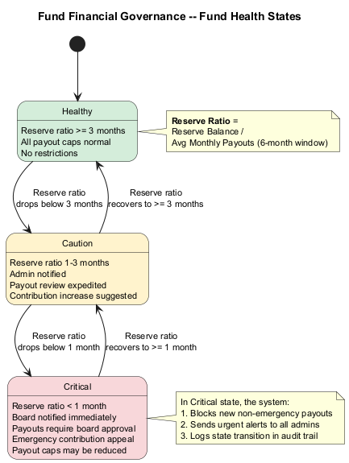

# Fund Financial Governance -- Detailed Design

## 1. Feature Purpose and Scope

Fund Financial Governance enforces the financial architecture that underpins the SafeNetQ mutual-aid model. Every dollar contributed is deterministically split across three segregated accounts (Trust, Operating, Reserve), and every payout is drawn exclusively from the Trust Account. The feature also manages waiting periods for new members and configurable payout caps per contribution tier, ensuring the fund remains solvent and fair.

### In Scope

| Capability | Description |
|---|---|
| **Account Separation** | Three logical accounts (Member Trust 85%, Reserve 10%, Operating 5%) with enforced boundaries. |
| **Contribution Splitting** | Each contribution is automatically split and routed to the correct accounts at ingestion time. |
| **Waiting Period** | Configurable hold period (default 3 months) before a new member is payout-eligible. |
| **Payout Caps** | Per-event and annual maximums per contribution tier, configurable by admins. |
| **Fund Health Monitoring** | Reserve-ratio computation that drives health indicators (Healthy / Caution / Critical). |
| **Reconciliation** | Monthly job comparing expected vs. actual account balances. |

### Out of Scope

- Payment processing mechanics (covered by Feature 04 and Feature 12).
- Admin UI for fund dashboards (covered by Feature 08).
- FINTRAC reporting (covered by Feature 10).

---

## 2. Technology Choices

| Layer | Technology | Rationale |
|---|---|---|
| Runtime | **.NET 8+** | Consistent platform stack. |
| Architecture | **Clean Architecture** | Domain rules for splitting, caps, and waiting periods live in the domain layer. |
| Database | **PostgreSQL 16** | ACID transactions for double-entry-style account movements. |
| Background Jobs | **Hangfire** | Reconciliation and waiting-period expiry checks. |
| Event Bus | **RabbitMQ** | ContributionReceived and PayoutApproved events trigger account movements. |

---

## 3. Security Considerations

1. **Immutable Ledger** -- All account transactions are append-only. Corrections are recorded as compensating entries, never as mutations.
2. **Double-Entry Integrity** -- Every movement has a debit and credit side; sum of all entries must net to zero.
3. **Admin-Only Cap Changes** -- Payout cap modifications require Admin role and are effective for future requests only.
4. **Audit Trail** -- Every transaction, cap change, and waiting-period override is logged with actor and timestamp.
5. **Concurrency Control** -- Optimistic concurrency on FundAccount balance updates to prevent race conditions.

---

## 4. Key Components

### 4.1 Domain Entities

| Entity | Purpose |
|---|---|
| `FundAccount` | Logical account with type (Trust/Operating/Reserve), current balance, and version for concurrency. |
| `AccountTransaction` | Immutable ledger entry: source account, destination account, amount, reference, timestamp, type. |
| `ContributionSplit` | Records the breakdown of a single contribution into trust, reserve, and operating portions. |
| `WaitingPeriod` | Tracks member's waiting-period start date, required duration, and whether it has been satisfied or reset. |
| `PayoutCapConfig` | Per-tier configuration: tier name, per-event max, annual max, effective date. |

### 4.2 Interfaces (Ports)

| Interface | Responsibility |
|---|---|
| `IFundAccountService` | GetBalance, RecordTransaction, GetTransactionHistory. |
| `IContributionSplitter` | SplitContribution -- applies the 85/10/5 rule and records transactions. |
| `IWaitingPeriodService` | GetStatus, CheckEligibility, ResetWaitingPeriod. |
| `IPayoutCapService` | GetCaps, ValidatePayout, UpdateCaps (admin). |
| `IFundHealthService` | GetHealthLevel, GetReserveRatio. |
| `IReconciliationService` | RunReconciliation -- compares expected vs. actual balances. |

### 4.3 Application Services

| Service | Notes |
|---|---|
| `FundAccountService : IFundAccountService` | Manages the three accounts with transactional integrity. Uses optimistic concurrency. |
| `ContributionSplitter : IContributionSplitter` | Listens for ContributionReceived events. Calculates split and records three AccountTransactions atomically. |
| `WaitingPeriodService : IWaitingPeriodService` | Computes eligibility based on join date and consecutive payment history. Resets on 2+ consecutive missed payments. |
| `PayoutCapService : IPayoutCapService` | Validates payout requests against per-event and rolling-12-month annual caps. |
| `FundHealthService : IFundHealthService` | Computes reserve ratio = Reserve balance / (average monthly payouts * 3). Maps to Healthy/Caution/Critical. |

### 4.4 Controllers (API Layer)

| Controller | Key Endpoints |
|---|---|
| `FundController` | `GET /api/v1/fund/health`, `GET /api/v1/fund/accounts` (admin), `GET /api/v1/fund/transactions` (admin) |
| `PayoutCapController` | `GET /api/v1/payout-caps`, `PUT /api/v1/payout-caps` (admin) |
| `WaitingPeriodController` | `GET /api/v1/waiting-period/status` |

### 4.5 DTOs

| DTO | Direction | Fields (summary) |
|---|---|---|
| `FundHealthDto` | Out | HealthLevel, ReserveRatioMonths |
| `AccountBalanceDto` | Out | AccountType, Balance, LastUpdated |
| `TransactionDto` | Out | Id, FromAccount, ToAccount, Amount, Type, Reference, Timestamp |
| `PayoutCapDto` | In/Out | Tier, PerEventMax, AnnualMax, EffectiveDate |
| `WaitingPeriodStatusDto` | Out | StartDate, RequiredMonths, MonthsCompleted, IsEligible |

---

## 5. Diagrams

### 5.1 Class Diagram

### 5.2 Contribution Split Sequence

### 5.3 Fund Health State Machine

