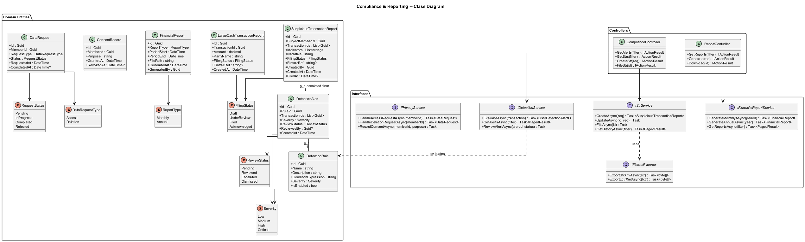
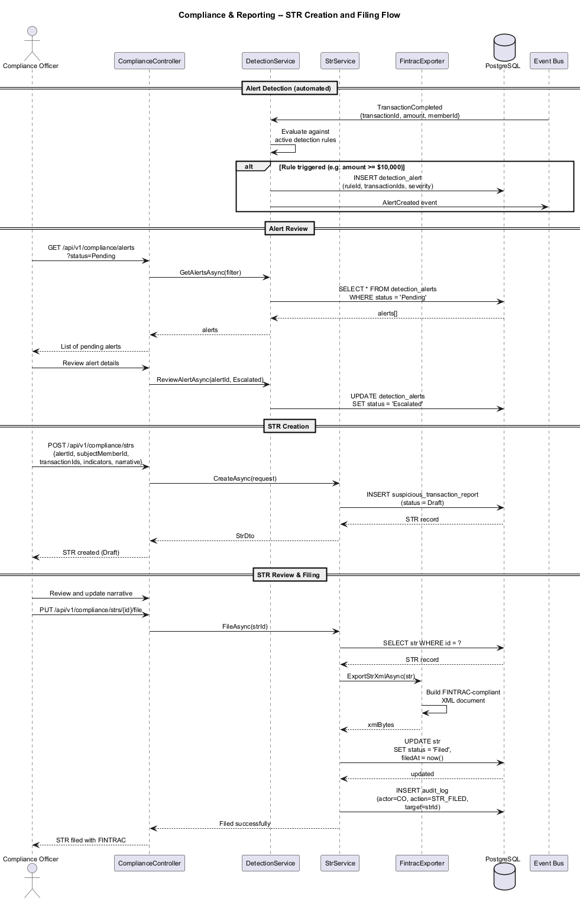
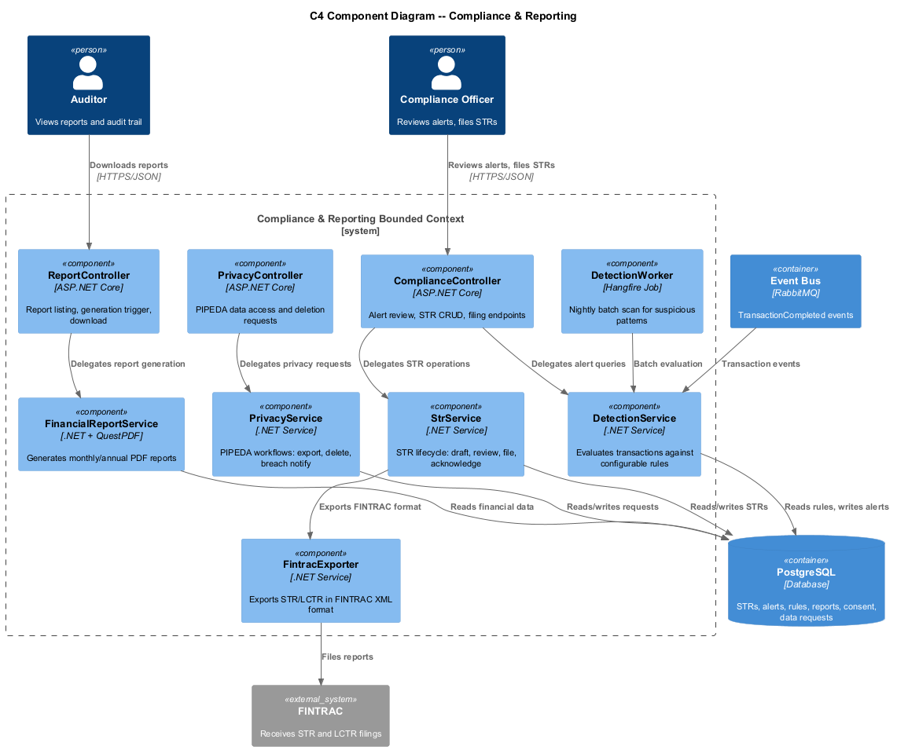

# Compliance & Reporting -- Detailed Design

## 1. Feature Purpose and Scope

The Compliance & Reporting feature ensures SafeNetQ meets its obligations under FINTRAC (Financial Transactions and Reports Analysis Centre of Canada) and PIPEDA (Personal Information Protection and Electronic Documents Act). It automates the detection, creation, and filing of Suspicious Transaction Reports (STRs) and Large Cash Transaction Reports (LCTRs), generates monthly and annual financial reports, and provides PIPEDA-compliant data management workflows.

### In Scope

| Capability | Description |
|---|---|
| **FINTRAC Reporting** | Automated flagging of transactions >= $10,000, suspicious activity detection, STR creation and filing workflow. |
| **Large Cash Transaction Reports** | Auto-generated for qualifying transactions with FINTRAC-format export. |
| **Suspicious Transaction Detection** | Rule-based detection for structuring, rapid in/out, unusual patterns. |
| **Financial Reports** | Monthly and annual reports: contributions, payouts, fund balances, reserve ratio, demographics (anonymized). |
| **PIPEDA Compliance** | Data access requests, deletion requests, breach notification workflow, consent management. |

### Out of Scope

- AML/KYC identity verification (covered by Feature 01).
- Admin dashboard UI for compliance (covered by Feature 08).
- Real-time fraud prevention at payment time (covered by Feature 12).

---

## 2. Technology Choices

| Layer | Technology | Rationale |
|---|---|---|
| Runtime | **.NET 8+** | Consistent platform stack. |
| Detection Engine | **Rule-based engine (custom)** | Configurable detection rules evaluated against transaction stream. |
| Report Generation | **QuestPDF** | .NET library for generating PDF financial reports. |
| Scheduling | **Hangfire** | Monthly/annual report generation and detection batch jobs. |
| Database | **PostgreSQL 16** | STR records, detection rules, report metadata, consent records. |
| Event Bus | **RabbitMQ** | TransactionCompleted events trigger detection evaluation. |

---

## 3. Security Considerations

1. **Role Restriction** -- STR and LCTR access restricted to Compliance Officer and Auditor roles. Filing actions require Compliance Officer.
2. **Immutable Records** -- Filed reports cannot be modified. Amendments create new linked records.
3. **Encryption** -- STR data encrypted at rest (AES-256-GCM) given the sensitive nature of the information.
4. **Audit Logging** -- Every STR view, creation, edit, and filing action is logged with actor, timestamp, and IP.
5. **PIPEDA Data Minimization** -- Reports use anonymized/aggregated data where possible. PII included only where legally required (STRs).
6. **Breach Notification** -- Automated workflow with configurable thresholds for notifying the Privacy Commissioner and affected members.

---

## 4. Key Components

### 4.1 Domain Entities

| Entity | Purpose |
|---|---|
| `SuspiciousTransactionReport` | STR record: subject, transactions, indicators, narrative, filing status, FINTRAC reference. |
| `LargeCashTransactionReport` | LCTR record: transaction details, parties, filing status. |
| `DetectionRule` | Configurable rule: name, condition expression, severity, enabled flag. |
| `DetectionAlert` | Alert generated when a rule fires: rule ref, transaction(s), severity, review status. |
| `FinancialReport` | Generated report metadata: type (monthly/annual), period, generation date, file path. |
| `ConsentRecord` | PIPEDA consent: member, purpose, granted date, revoked date. |
| `DataRequest` | PIPEDA data access or deletion request: member, type, status, completion date. |

### 4.2 Interfaces (Ports)

| Interface | Responsibility |
|---|---|
| `IDetectionService` | EvaluateTransaction, GetAlerts, ReviewAlert. |
| `IStrService` | CreateStr, UpdateStr, FileStr, GetStrHistory. |
| `ILctrService` | CreateLctr, FileLctr. |
| `IFinancialReportService` | GenerateMonthly, GenerateAnnual, GetReports, DownloadReport. |
| `IPrivacyService` | HandleDataAccessRequest, HandleDeletionRequest, RecordConsent, InitiateBreachNotification. |
| `IFintracExporter` | Export STR/LCTR in FINTRAC-accepted XML format. |

### 4.3 Application Services

| Service | Notes |
|---|---|
| `DetectionService : IDetectionService` | Evaluates transactions against active rules. Creates alerts for review. Runs both real-time (event-driven) and batch (nightly scan). |
| `StrService : IStrService` | Manages STR lifecycle: draft, under review, filed, acknowledged. Calls IFintracExporter for format compliance. |
| `FinancialReportService : IFinancialReportService` | Aggregates data from contributions, payouts, and fund accounts. Generates PDF via QuestPDF. Scheduled via Hangfire. |
| `PrivacyService : IPrivacyService` | Handles PIPEDA workflows: data export (JSON/CSV), deletion with 30-day SLA, breach notification chain. |

### 4.4 Controllers (API Layer)

| Controller | Key Endpoints |
|---|---|
| `ComplianceController` | `GET /api/v1/compliance/alerts`, `GET /api/v1/compliance/strs`, `POST /api/v1/compliance/strs`, `PUT /api/v1/compliance/strs/{id}/file` |
| `ReportController` | `GET /api/v1/reports`, `POST /api/v1/reports/generate`, `GET /api/v1/reports/{id}/download` |
| `PrivacyController` | `POST /api/v1/privacy/data-request`, `POST /api/v1/privacy/deletion-request`, `GET /api/v1/privacy/consents` |

### 4.5 DTOs

| DTO | Direction | Fields (summary) |
|---|---|---|
| `DetectionAlertDto` | Out | Id, RuleName, Severity, TransactionIds, Status, CreatedAt |
| `StrDto` | In/Out | Id, SubjectMemberId, TransactionIds, Indicators[], Narrative, FilingStatus, FintracRef |
| `StrCreateRequest` | In | AlertId, SubjectMemberId, TransactionIds, Indicators[], Narrative |
| `FinancialReportDto` | Out | Id, Type, Period, GeneratedAt, DownloadUrl |
| `DataRequestDto` | In | RequestType (Access/Deletion) |
| `DataRequestStatusDto` | Out | Id, Type, Status, RequestedAt, CompletedAt |

---

## 5. Diagrams

### 5.1 Class Diagram

### 5.2 STR Filing Sequence

### 5.3 C4 Component Diagram -- Compliance

