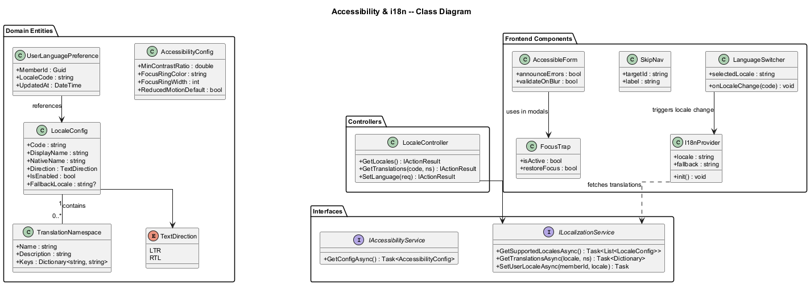
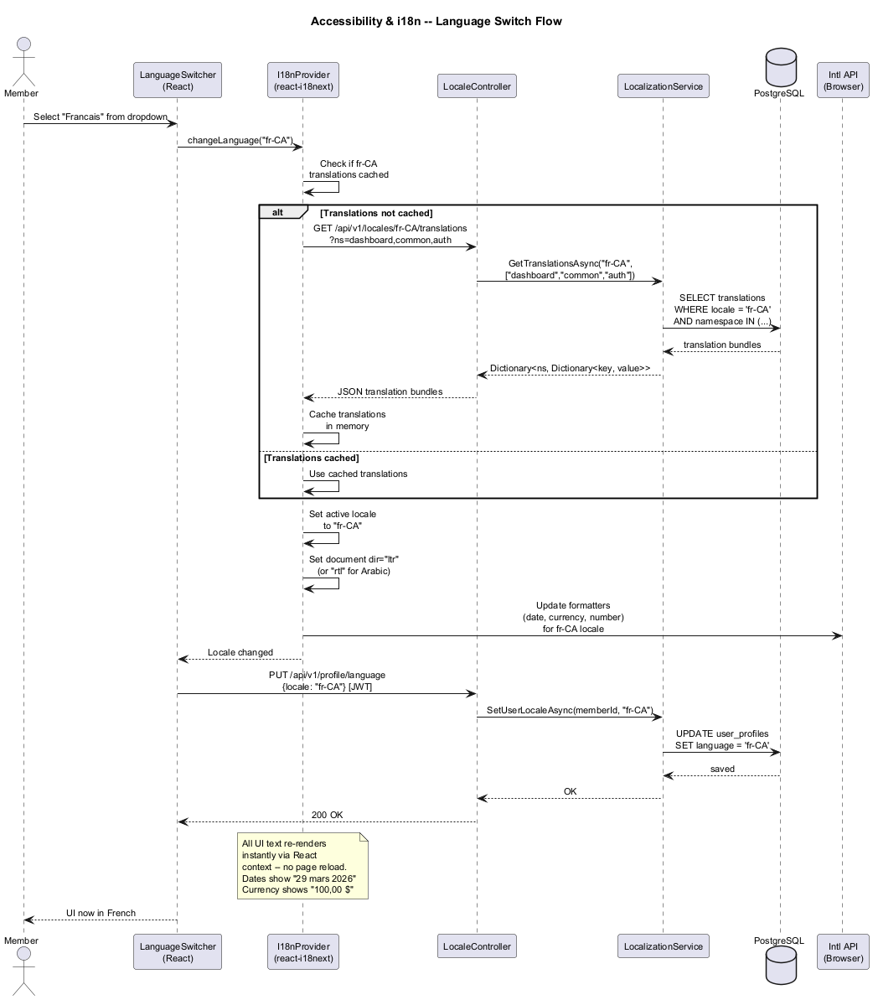

# Accessibility & Internationalization -- Detailed Design

## 1. Feature Purpose and Scope

This feature ensures SafeNetQ is usable by all members regardless of ability or language preference. The platform must meet WCAG 2.0 Level AA standards (required by Ontario's AODA legislation) and support English, French, and additional community languages through a robust internationalization (i18n) framework.

### In Scope

| Capability | Description |
|---|---|
| **WCAG 2.0 AA Compliance** | Keyboard navigation, screen reader support, color contrast, focus indicators, ARIA roles/labels. |
| **AODA Compliance** | Meets Accessibility for Ontarians with Disabilities Act requirements for web applications. |
| **Multi-Language Support** | English and French at launch; extensible framework for additional languages via translation files. |
| **Locale-Aware Formatting** | Date, currency, and number formatting adapts to the selected locale. |
| **Language Switching** | In-app language selector with immediate UI update (no page reload). |
| **RTL Layout Support** | CSS infrastructure for future right-to-left languages (Arabic, Hebrew, Urdu). |

### Out of Scope

- Machine translation of user-generated content.
- Voice-based UI interaction.
- Real-time sign-language interpretation.

---

## 2. Technology Choices

| Layer | Technology | Rationale |
|---|---|---|
| Frontend i18n | **react-i18next** | Industry-standard React i18n with namespace support, lazy loading, and pluralization. |
| Translation Files | **JSON** per locale per namespace | Simple, tooling-friendly format. Example: `en/dashboard.json`, `fr/dashboard.json`. |
| Locale Formatting | **Intl API** (browser-native) | Date, number, and currency formatting without extra libraries. |
| Accessibility Testing | **axe-core** + **jest-axe** | Automated a11y testing in unit and integration tests. |
| Screen Reader Testing | **NVDA / VoiceOver** | Manual testing with popular screen readers. |
| CSS RTL | **CSS logical properties** + `dir="rtl"` attribute | Future-proof RTL support without duplicate stylesheets. |
| Backend Localization | **.NET IStringLocalizer** | Server-side error messages and email templates in the member's preferred language. |

---

## 3. Security Considerations

1. **Language Preference Storage** -- Stored in user profile (not cookie-only) to ensure consistency across devices.
2. **Translation Injection** -- All translation strings are escaped before rendering to prevent XSS via malicious translation files.
3. **No PII in Translations** -- Translation files contain only static UI strings; dynamic data is injected at render time.

---

## 4. Key Components

### 4.1 Domain Entities

| Entity | Purpose |
|---|---|
| `LocaleConfig` | Supported locale definition: code (e.g., `en-CA`, `fr-CA`), display name, direction (LTR/RTL), enabled flag. |
| `TranslationNamespace` | Logical grouping of translation keys (e.g., `dashboard`, `auth`, `notifications`). |
| `AccessibilityConfig` | Platform-level a11y settings: minimum contrast ratio, focus style, reduced motion preference. |
| `UserLanguagePreference` | Member's selected locale, stored in profile. |

### 4.2 Interfaces (Ports)

| Interface | Responsibility |
|---|---|
| `ILocalizationService` | GetSupportedLocales, GetTranslations(locale, namespace), SetUserLocale. |
| `IAccessibilityService` | GetConfig, ValidateComponent (dev-time helper for a11y checks). |

### 4.3 Application Services

| Service | Notes |
|---|---|
| `LocalizationService : ILocalizationService` | Serves translation JSON bundles. Supports lazy loading by namespace. Manages locale fallback chain (e.g., `fr-CA` -> `fr` -> `en`). |

### 4.4 Controllers (API Layer)

| Controller | Key Endpoints |
|---|---|
| `LocaleController` | `GET /api/v1/locales` (list supported), `GET /api/v1/locales/{code}/translations?ns=` (get bundle), `PUT /api/v1/profile/language` |

### 4.5 Frontend Architecture

| Component | Responsibility |
|---|---|
| `I18nProvider` | Wraps app in react-i18next provider, initializes locale from user profile or browser preference. |
| `LanguageSwitcher` | Dropdown component in app header; triggers locale change without page reload. |
| `AccessibleForm` | HOC/wrapper ensuring all form fields have labels, error announcements, and keyboard navigation. |
| `SkipNav` | "Skip to main content" link visible on focus for keyboard users. |
| `FocusTrap` | Traps focus within modal dialogs per WCAG 2.4.3. |

### 4.6 WCAG 2.0 AA Checklist (Key Items)

| Criterion | Implementation |
|---|---|
| 1.1.1 Non-text Content | All images have `alt` text; decorative images use `alt=""`. |
| 1.3.1 Info and Relationships | Semantic HTML5 elements; ARIA landmarks for navigation, main, complementary. |
| 1.4.3 Contrast (Minimum) | 4.5:1 for normal text, 3:1 for large text. Enforced in design system tokens. |
| 2.1.1 Keyboard | All interactive elements reachable and operable via keyboard. Tab order is logical. |
| 2.4.3 Focus Order | Focus moves in DOM order. Modals trap focus. |
| 2.4.7 Focus Visible | Custom focus ring (2px solid, high-contrast color) on all interactive elements. |
| 3.3.1 Error Identification | Form errors announced by screen reader via `aria-live="assertive"` and associated with fields via `aria-describedby`. |
| 4.1.2 Name, Role, Value | Custom components expose name, role, and state via ARIA attributes. |

---

## 5. Diagrams

### 5.1 Class Diagram

### 5.2 Language Switch Sequence

