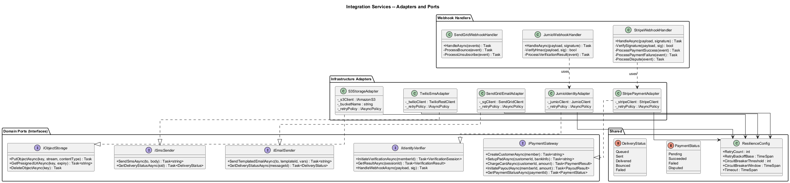
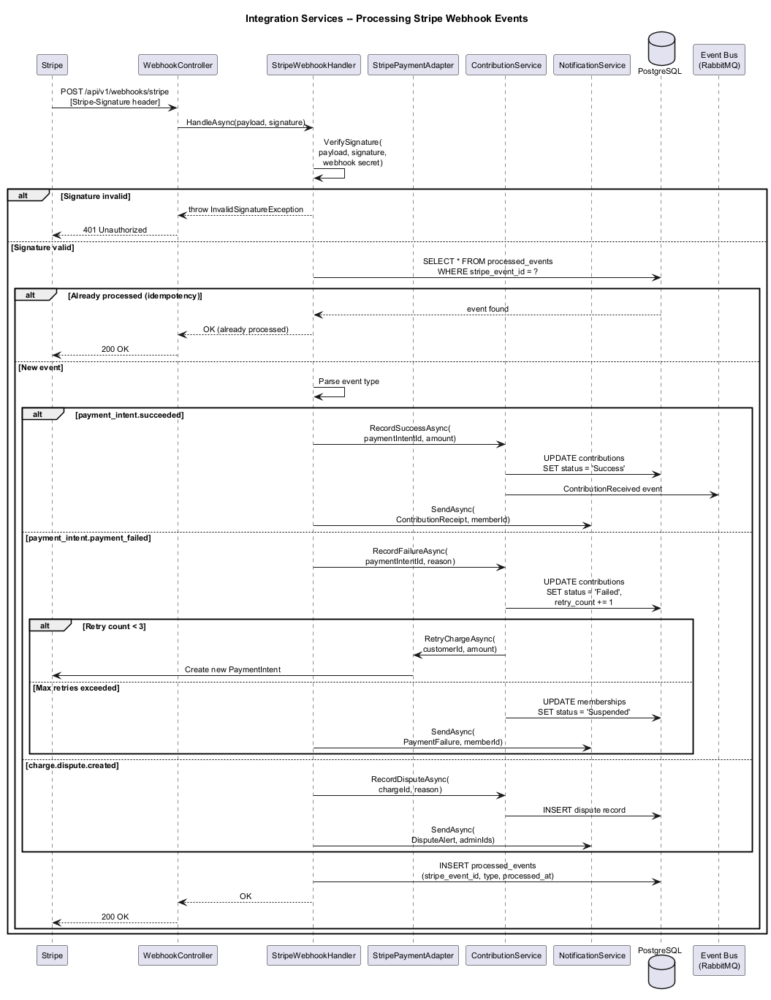
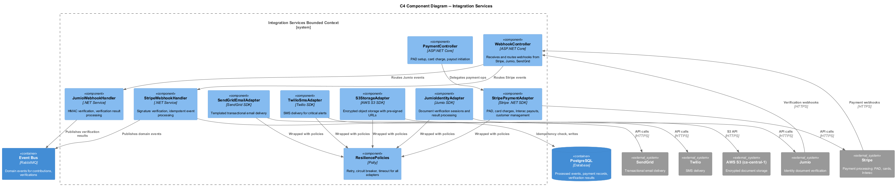

# Integration Services -- Detailed Design

## 1. Feature Purpose and Scope

Integration Services provides the adapter layer connecting SafeNetQ's domain logic to external third-party services: payment processing (Stripe), identity verification (Jumio), notification delivery (SendGrid, Twilio), and document storage (AWS S3 / Azure Blob). All integrations follow a Ports & Adapters pattern so that providers can be swapped without domain-layer changes.

### In Scope

| Capability | Description |
|---|---|
| **Payment (Stripe)** | PAD setup, recurring billing, credit card tokenization (Stripe Elements), Interac e-Transfer payout, webhook processing. |
| **Identity (Jumio)** | Document capture SDK integration, webhook-based verification results, manual-review fallback. |
| **Notifications (SendGrid / Twilio)** | Templated transactional email, SMS delivery for critical alerts, delivery status tracking. |
| **Storage (S3 / Azure Blob)** | Encrypted object storage in Canadian region, pre-signed URL generation, lifecycle policies. |

### Out of Scope

- Banking API integration (Flinks) -- deferred to future phase.
- Direct Moneris integration (Stripe is primary; Moneris as future alternative).
- Mobile push notification delivery (FCM -- covered in Feature 06 notification architecture).

---

## 2. Technology Choices

| Layer | Technology | Rationale |
|---|---|---|
| Runtime | **.NET 8+** | Consistent platform stack. |
| Payment | **Stripe .NET SDK** | PCI-compliant, supports PAD (ACSS Debit), Cards, Interac. Canadian entity support. |
| Identity | **Jumio .NET SDK** | Document AI, liveness detection, webhook-driven results. |
| Email | **SendGrid .NET SDK** | Template management, delivery tracking, CASL compliance. |
| SMS | **Twilio .NET SDK** | Programmable SMS with delivery receipts. |
| Storage | **AWS SDK for .NET (S3)** | SSE-KMS encryption, pre-signed URLs, lifecycle policies. Canadian region. |
| Resilience | **Polly** | Retry, circuit breaker, and timeout policies for all external calls. |
| Webhook Security | **HMAC verification** | Stripe signature verification, Jumio webhook signing. |

---

## 3. Security Considerations

1. **API Keys** -- All provider API keys stored in Azure Key Vault / AWS Secrets Manager, injected via environment at startup. Never in source code or config files.
2. **Webhook Verification** -- Every incoming webhook verified via HMAC signature (Stripe: `Stripe-Signature` header; Jumio: HMAC-SHA256).
3. **PCI Compliance** -- Credit card data never touches SafeNetQ servers. Stripe Elements handles tokenization client-side.
4. **Idempotency** -- All webhook handlers are idempotent. Event IDs are tracked to prevent duplicate processing.
5. **Circuit Breaker** -- Polly circuit breaker on each external service: open after 5 failures in 30 seconds, half-open after 60 seconds.
6. **Data Residency** -- S3 bucket restricted to `ca-central-1`. Stripe account configured for Canadian processing.
7. **Audit Logging** -- All external API calls logged with correlation ID, latency, and response status.

---

## 4. Key Components

### 4.1 Domain Interfaces (Ports)

| Port Interface | Responsibility |
|---|---|
| `IPaymentGateway` | CreateCustomer, SetupPad, ChargeCard, InitiatePayout, GetPaymentStatus. |
| `IIdentityVerifier` | InitiateVerification, GetResult, HandleWebhook. |
| `IEmailSender` | SendTemplatedEmail, GetDeliveryStatus. |
| `ISmsSender` | SendSms, GetDeliveryStatus. |
| `IObjectStorage` | PutObject, GetPresignedUrl, DeleteObject, SetLifecyclePolicy. |

### 4.2 Adapters (Infrastructure Layer)

| Adapter | Implements | Notes |
|---|---|---|
| `StripePaymentAdapter` | `IPaymentGateway` | Wraps Stripe .NET SDK. Handles ACSS Debit (PAD), card charges, Interac payouts. |
| `JumioIdentityAdapter` | `IIdentityVerifier` | Wraps Jumio SDK. Initiates verification sessions, processes webhook callbacks. |
| `SendGridEmailAdapter` | `IEmailSender` | Wraps SendGrid SDK. Uses dynamic templates with variable substitution. |
| `TwilioSmsAdapter` | `ISmsSender` | Wraps Twilio SDK. Sends from a Canadian number. |
| `S3StorageAdapter` | `IObjectStorage` | Wraps AWS S3 SDK. SSE-KMS encryption, pre-signed URLs, lifecycle rules. |

### 4.3 Webhook Handlers

| Handler | Events Processed |
|---|---|
| `StripeWebhookHandler` | `payment_intent.succeeded`, `payment_intent.payment_failed`, `charge.dispute.created`, `customer.subscription.deleted` |
| `JumioWebhookHandler` | `VERIFICATION_COMPLETED`, `VERIFICATION_FAILED`, `VERIFICATION_EXPIRED` |
| `SendGridWebhookHandler` | `delivered`, `bounced`, `spam_report`, `unsubscribe` |

### 4.4 Controllers (API Layer)

| Controller | Key Endpoints |
|---|---|
| `WebhookController` | `POST /api/v1/webhooks/stripe`, `POST /api/v1/webhooks/jumio`, `POST /api/v1/webhooks/sendgrid` |
| `PaymentController` | `POST /api/v1/payments/setup-pad`, `POST /api/v1/payments/charge`, `POST /api/v1/payments/payout` |

### 4.5 Resilience Configuration

| Service | Retry | Circuit Breaker | Timeout |
|---|---|---|---|
| Stripe | 3 retries, exponential backoff | 5 failures / 30s | 30s |
| Jumio | 2 retries, exponential backoff | 3 failures / 60s | 45s |
| SendGrid | 3 retries, exponential backoff | 5 failures / 30s | 15s |
| Twilio | 2 retries, exponential backoff | 5 failures / 30s | 15s |
| S3 | 3 retries, exponential backoff | 5 failures / 30s | 60s |

---

## 5. Diagrams

### 5.1 Class Diagram -- Integration Adapters and Ports

### 5.2 Stripe Webhook Processing Sequence

### 5.3 C4 Component Diagram -- Integration Services

